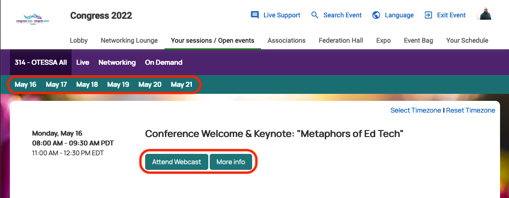

--- 
title: "OTESSA 2022 Program"
author: "Open Technology in Education, Society, and Scholarship Association"
date: "Last updated `r format(Sys.time(), '%A, %b %d, %H:%M %p, %Z')`"
site: bookdown::bookdown_site
output: bookdown::gitbook
documentclass: book
bibliography: [book.bib]
biblio-style: apalike
link-citations: yes
github-repo: otessa/2022
description: "Open Technology in Education, Society, and Scholarship Association"
---

# Welcome {-}

Welcome to our searchable program. We will continue to update this site throughout the conference as changes arise.

```{block, type='protip'}

#### ✨ Note{-}

***All times are in Eastern Time (Canada)***
```


All OTESSA Participants can attend the [Congress “Big Thinking” lecture series](https://www.federationhss.ca/en/congress/congress-2022/open-programming){target="_blank"}. These take place each day of the conference. Congress has “[open events](https://www.federationhss.ca/en/congress/congress-2022/calendar-open-events){target="_blank"}” available as well (open to registrants across association conferences at Congress as well as those who hold community passes).

All OTESSA Registrants can also attend conference sessions offered by the [Canadian Association for the Study of Education (CSSE)](https://csse-scee.ca/){target="_blank"}, [Canadian Association for the Study of Higher Education (CSSHE)](https://csshe-scees.ca/){target="_blank"}, [Canadian Association of Learned Journals (CALJ)](https://www.calj-acrs.ca/){target="_blank"}, and [Canadian Association for the Study of Adult Education (CASAE)](https://www.casae-aceea.ca/){target="_blank"} as we have reciprocity agreements in place. 

Please note that presenters must register in each conference in which they are presenting. 

## Sponsors {-}

### Advocates {-}

[](https://www.ecampusontario.ca/){target="_blank"}  


### Partners {-}

[](https://www.campusmanitoba.ca/){target="_blank"}  

### Friends {-}

[](https://bccampus.ca){target="_blank"}  
<br>  

[](https://uvic.ca/education){target="_blank"}  
<br>

[](https://uvic.ca/president){target="_blank"}  
[](https://trentu.ca/online){target="_blank"}  

## Interaction Tips {-}

The toolbar at the top of the program allows you to customize your view of the program.


### Table of Contents {-}

Click the 'hamburger menu' to toggle open or close the table of contents.

### Search  {-}

Use the search tool to search the full text of the program, including presenters, keywords, titles, research/practice, and the full text of abstracts that are available at the time of the latest update. This feature will filter the Table of Contents so that only the pages containing your search terms will appear.

### Customize Text {-}

Use this tool to change the font size and style (serif/sans-serif), or to choose a White, Sepia, or Night (less recommended) theme.

### Downloads {-}

Each time we build the page, we will generate an up-to-date ePub document for download.

### Information {-}

Tips for navigating the program with your keyboard.

### Session Links {-}

In each session in the program, you will see a 'Session Link'. This link will take you to the Congress platform, where you will need to sign in and navigate to the specific day and session within that interface.

<!--chapter:end:index.Rmd-->

# Errors and Updates {-}

```{block, type='feedback'}

#### **One for All, All for One, to Support and Enable Our Learning  Societies** 

Session 1.2

*Nadia Naffi*

***Rescheduled for 2023***

```

<!--chapter:end:01-errata.Rmd-->

# Keynotes {-}

```{block, type='protip'}
#### Join us for the #OTESSA22 Morning Radio Show every morning Monday-Thursday 9:30-10:30 (Eastern) at https://voiced.ca
```

## Martin Weller {-}

***Monday, May 16, 11:00 AM***

```{block, type='reflect'}
### Metaphors of EdTech

In this talk, I will explore why metaphors are both a useful and potentially misleading way of thinking about educational technology. A number of metaphors will be proposed and analysed which demonstrate how metaphors can shape our thinking and help us view educational technology from different perspectives. The Covid pandemic saw nearly all education institutions engaging in an online pivot, which usually involved online versions of existing practices, such as lectures. As we seek to build on this experience and offer a richer online experience it has become evident that the face-to-face lecture has become a dominant model that many struggle to see past. This talk will examine how different metaphors can help us approach educational technology.  

##### [Session Link](https://app.forj.ai/en?t=/tradeshow/index&page=auditorium&id=1638304532451&auditorium_room_id=1647886846001){target="_blank"}
```

## Sherri Spelic {-}

***Tuesday, May 17, 11:00 AM***

```{block, type='reflect'}
### Hide and Seek: On Kids, Power, and Resistance in Education

I want to explore what happens when the learners in our care resist our offer of help, expertise, and teaching. How do we make sense of students applying refusal skills in the classroom? Rather than provide answers I will draw on student statements about the possibility and significance of saying "no" at school and use these to probe our understanding and appreciation of power in students' hands and voices. We'll also pose the question: to what degree do our pedagogies leave space for negotiation and power sharing? And where does this show itself in practice?

##### [Session Link](https://app.forj.ai/en?t=/tradeshow/index&page=auditorium&id=1638304532451&auditorium_room_id=1647886846001){target="_blank"}
```

## Maha Bali {-}

***Wednesday, May 18, 11:00 AM***

```{block, type='reflect'}
### Outside-In: Openness as Subversion


We often talk about how open education expands access, supports knowledge sharing, and potentially enhances the quality of education. We also critique open education for sometimes reproducing inequalities despite promising to promote social justice.  
But what about the ways in which "openness" removes/destroys barriers within us? In what ways does openness empower us from the outside-in? When does openness influence critical change and when might it fail to do so?  
In this interactive session, we will explore some of the things openness makes possible that are often not possible within the walls of institutions, and which can end up challenging and subverting injustice.

##### [Session Link](https://app.forj.ai/en?t=/tradeshow/index&page=auditorium&id=1638304532451&auditorium_room_id=1647886846001){target="_blank"}
```

## Brenna Clarke Gray {-}

***Thursday, May 19, 11:00 AM***

```{block, type='reflect'}
### Things Unsaid: Exploring the Margins and Limits of Open

**Keywords:** limits of open, challenges to open, autoethnography, pregnancy loss and miscarriage, institutional silences


Open is not an unambiguous good, a panacea, or accessible to everyone. But maybe it could be more of all of those things if, as a community, we could talk more openly about open’s borders and limitations. What does it mean to say we are a community of open educators? What is the edge of open-ness, and how do we account for its definition? What — and whose — truths remain unsaid or unspoken even in communities that define themselves as open? And who is safe to choose open? Offering an autoethnography of pregnancy loss set against the backdrop of the pandemic university as a place to start this exploration, this talk looks to chart the margins and limits of open and to ask about the benefits of expanding the scope and possibilities of openness in our institutions. It invites all of us to imagine a more perfect open, or at least to consider how more of us can be supported to speak our things unsaid.

##### [Session Link](https://app.forj.ai/en?t=/tradeshow/index&page=auditorium&id=1638304532451&auditorium_room_id=1647886846001){target="_blank"}
```

## Congress Events {-}

```{block, type='feedback'}

### [Click here to access a schedule of all open Congress events.](https://app.forj.ai/en?t=/tradeshow/index&page=auditorium&id=1638304532451&auditorium_room_id=1647886187226){target="_blank"}

```

<!--chapter:end:01-keynotes.Rmd-->

# Monday, May 16, 2022 

```{block, type='protip'}
#### Join us for the #OTESSA22 Morning Radio Show every morning Monday-Thursday 9:30-10:30 (Eastern) at https://voiced.ca
```
### Legend {-}

```{block, type='protip'}

#### ✨ Note{-}

***All times are in Eastern Time (Canada)***
```

```{block, type='reflect'}
#### Keynote

```

```{block, type='wp'}
#### Invited Speaker

```

```{block, type='secondary'}
#### Regular Session

```
```{block, type='gh'}
#### Social Session

```

--- 


##  Welcome Desk Open (10:30 - 12:30) {-}

## Conference Welcome and Keynote (11:00 - 12:30) {-}

```{block, type='reflect'}
#### Metaphors of Ed Tech
*Martin Weller*  

In this talk, I will explore why metaphors are both a useful and potentially misleading way of thinking about educational technology. A number of metaphors will be proposed and analysed which demonstrate how metaphors can shape our thinking and help us view educational technology from different perspectives. The Covid pandemic saw nearly all education institutions engaging in an online pivot, which usually involved online versions of existing practices, such as lectures. As we seek to build on this experience and offer a richer online experience it has become evident that the face-to-face lecture has become a dominant model that many struggle to see past. This talk will examine how different metaphors can help us approach educational technology.  

##### [Session Link](https://app.forj.ai/en?t=/tradeshow/index&page=auditorium&id=1638304532451&auditorium_room_id=1647886846001){target="_blank"}
```

## Break (12:30 - 1:00) {-}

## Parallel Session 1 - Invited Speakers (1:00 – 1:45)  {-}

### Parallel Session 1.1 {-}

```{block, type='wp'}
#### **Embracing the Middle**

*Jess Mitchell*

**Keywords:** liminal, equity, inclusion

#### Abstract 

Small, Medium, Large; Short, Medium, Long; Yes, No, Maybe; Black, White, Grey  

##### [Session Link](https://app.forj.ai/en?t=/tradeshow/index&page=auditorium&id=1638304532451&auditorium_room_id=1647886846001){target="_blank"}
```

### Parallel Session 1.2 {-}

```{block, type='wp'}
#### **One for All, All for One, to Support and Enable Our Learning  Societies** 

*Nadia Naffi*

***Rescheduled for 2023***
<!--
**Keywords:** Sustainable educational transformation, Learning society, Learning ecosystem, Higher education, Society 5.0

#### Abstract 

The acceleration of digitalization, of automation and of cyber-physical systems, the web3.0, the gig economy, the climate change crisis, the demographic changes, the investment in green and renewable technologies and the extended lifespans, to name only few disruptive events, are reshaping the social and work-related skills we need and the way we acquire them. When COVID-19 hit, we were reminded that we were all interconnected and that educational transformation will never happen if the stakeholders remain in their own bubbles. The pandemic accentuated the urgency to rethink the role of higher education within the learning ecosystem to answer the needs of today and tomorrow’s learners, namely those who are left behind by the systems. In this presentation I’m calling for action to break silos and incite, strengthen, and sustain partnerships between all actors to support and enable our learning societies and to ensure, together, the sustainable change we need, especially if we decide to realize the vision of Society 5.0, a people-centric society with a sustainable, inclusive socio-economic system. 
-->
```

```{block, type='wp'}
#### **Four Pillars to (re)Think Universities** 

*Ann-Louise Davidson*

**Keywords:** AI, re-thinking universities, micro-credentials, prior learning recognition, mentoring, partnerships

#### Abstract 

The closure of universities due to the COVID-19 pandemic in March 2020 has exacerbated many challenges. In addition to the devastating loss of revenue due to the absence of students on campus, criticisms of traditional testing, content relevance, equity, diversity and inclusion, the skills gap between what graduates offer and what employers are looking for brings new layers to the crisis. These issues must be overcome so that a diverse population of students can be better prepared for the increasingly demanding and complex job market caused by major technological disruptions as the world enters the age of AI and the 4th Industrial Revolution. More than ever, universities need to rethink the concept of learning experiences and learning spaces and provide opportunities for lifelong learning so that intellectual exchanges can take place both among students as peers and between students and extra-academic actors to bring greater relevance to what students learn through the curriculum. In this presentation, I will discuss the concept of an alternative university that rests on four pillars: micro-credentials, prior learning recognition, mentoring, and partnerships.

##### [Session Link](https://app.forj.ai/en?t=/tradeshow/index&page=auditorium&id=1638304532451&auditorium_room_id=1647886846001){target="_blank"}
```
## Break (1:45 – 2:15) {-}

## Parallel Session 2 (2:15 – 3:45) {-}

### Parallel Session 2.1 - WILDCARD: Indigenous Language Revival & K12 Truth & Reconciliation {-}

```{block, type='secondary'}
#### 2:15-2:45 
**Elders’ Conversations: Perspectives on leveraging digital technology in language revival (Research-Oriented)**

*Melissa Bishop*

**Keywords:** language revival, Indigenous, elder, digital technology, computer-assisted language learning, guarded optimism, FNMI

#### Abstract 

Elders are held in high regard in First Nations, Metis, and Inuit (FNMI) communities. They are the intergenerational transmitters of ancestral language and Indigenous knowledge. Without language revival initiatives, ancestral languages in FNMI communities are at risk of extinction. Leveraging digital technologies while collaborating with Elders can support revival initiatives. Through semi-structured interviews and qualitative analysis, this study addresses how three Elders who use technology in their ancestral language teaching (1) describe the benefits, drawbacks, and preferences of technology; (2) reveal the accuracy with which cultural knowledge is imparted through technology; and (3) view the impact of technology on their role as traditional knowledge keepers and intergenerational language transmitters? Findings suggest that while Elders acknowledge the benefits when leveraging digital tools in language revival initiatives, they have concerns about technology’s potential negative impacts on relationality [culture, spirituality, and medicine practices], a concept I have termed guarded optimism.

##### [Session Link](https://app.forj.ai/en?t=/tradeshow/index&page=auditorium&id=1638304532451&auditorium_room_id=1647886846001){target="_blank"}

```

```{block, type='secondary'}
#### 2:45-3:45 {-}

**Truth and Reconciliation Through Inquiry-based Collaborative Learning (Practice-Oriented)**

_Deirdre Houghton (Nechako Lakes School District & University of Victoria), Gary Soles (Nechako Lakes School District & University of Victoria), Andrew Vogelsang (Nechako Lakes School District & University of Victoria), Valerie Irvine (University of Victoria), Frances “Guy” Prince (Knowledge Holder, Nak’azdli Whut’en), Leona Prince (Nechako Lakes School District), Carla Martin (Nechako Lakes School District), Jean-Paul Restoule (University of Victoria), Michael Paskevicius (University of Victoria)_

<!--
[Materials](https://conference.otessa.org/index.php/conference/article/view/126)
-->


**Keywords**: Truth and Reconciliation, Inquiry, Secondary school, K-12, Cross-curricular, Project-based learning, Collaboration, Co-Teaching

#### Abstract

In this session, we will share a project conducted at [school name removed for review] in the [district name removed for review], which is in Northern British Columbia, Canada. Three highschool teachers from different disciplines (Social Studies, Digital Media, and Carpentry) launched a cross-curricular inquiry-based project, focusing on truth and reconciliation,  that connected the learners in their highschool and the broader community, including knowledge holders from the local Indigenous communities. Those engaged in the project examined questions around what truth and reconciliation meant to the learners and its significance. Resulting products included a legacy wall containing individual learning represented in motifs, design of the feather using wood from around the world, and a video documentary containing interviews from school and community stakeholders. We will screen clips of videos during our session, but invite participants to pre-screen the two videos (Documentary Parts 1 and 2), which can be accessed on our YouTube playlist, where a process video and a reflection video are also available.

##### [Session Link](https://app.forj.ai/en?t=/tradeshow/index&page=auditorium&id=1638304532451&auditorium_room_id=1647886846001){target="_blank"}

``` 

### Parallel Session 2.2 – Sustaining Positive Change: PSE Ethics & PSE Scholarship {-}

```{block, type='secondary'}
#### 2:15-3:00 {-}

**Surveillance in the System: Data as Critical Change in Higher Education (Research-Oriented)**

_Bonnie Stewart (University of Windsor), Samatha Szcyrek (University of Windsor)_

**Keywords:** data, datafication, data literacy, data ethics, higher education

#### Abstract 

Over recent decades, higher education infrastructures have become increasingly digitized and datafied. The COVID-19 pandemic accelerated adoption of online learning platforms, trading the walls of the classroom for digital systems. Yet the surveillance, privacy, and security issues that such systems raise are minimally understood by those who teach and learn within them. This presentation overviews a 2020 pilot survey and 2021-22 qualitative study of higher education instructors from different parts of the globe. These projects explored the ways in which instructors from various locales and academic status positions understand data and classroom tools; the presentation draws on those studies to frame concerns about datafication amplifying inequity in higher education. Its premises are twofold: first, if higher education instructors, as knowledge workers, are not knowledgeable about the contexts within which they teach and conduct scholarship, then the construct of shared governance within higher education is inevitably undermined. Secondly, if faculty and academic decision-makers are not intentional about equitable and ethical use of digital platforms within higher education, students’ privacy and data is at risk. The presentation will outline findings and frame datafication as a critical change within higher education culture that could be addressed through a sector-wide ethics approach.

##### [Session Link](https://app.forj.ai/en?t=/tradeshow/index&page=auditorium&id=1638304532451&auditorium_room_id=1647886846001){target="_blank"}
```
<!--
```{block, type='secondary'}
####  2:45-3:45 {-}

**Cognification in Education in Light of the Fourth Industrial Revolution (Research-Oriented)**

_Vivekanandan Kumar (Athabasca University), Mohamed Ally (Athabasca University), Avgoustos Tsinakos (International Hellenic University), Muhammad Helmi Norman (Universiti Kebangsaan Malaysia)_

**Keywords:** cognification, fourth industrial revolution, AI, technology-enabled teaching and learning, learning analytics

#### Abstract 

Over the past decade, opportunities for online learning have dramatically increased. Learners around the world now have digital access to a wide array of corporate trainings, certifications, comprehensive academic degree programs, and other educational and training options. Some organizations are blending traditional instruction methods with online technologies. Blended learning generates large volumes of data about both the content (quality and usage) and the learners (study habits and learning outcomes). Correspondingly, the need to properly process voluminous, continuous, and often disparate data has prompted the advent of cognification. Cognification is the art of making something increasingly, ethically, and regulatably smart. Cognification techniques design complex data analytic models that allow natural intelligence to engage artificial smartness in ways that can enhance the learning experience. This panel will highlight how emerging trends in cognification and the Fourth Industrial Revolution could disrupt online education.
```
-->
### Parallel Session 2.3 – Transitions of Online Learning and Teaching: E-Texts / OER {-}

```{block, type='secondary'}
#### 2:15-2:45 {-}

**Investigating the effects of computer-generated contextual landmarks on short-term recall of e-texts (Research-Oriented)**

_Jon Dron, Rory McGreal, Vive Kumar, Jennifer Davies (Athabasca University)_

**Keywords:** e-text, recall, learning, navigation, OER, reading, open educational resources

#### Abstract 

E-texts have many advantages over their paper counterparts, especially when reflowable and available as open educational resources (OERs). Unfortunately, research suggests that e-texts are, on the whole, less memorable than p-texts, in part due to their relative lack of visual navigational landmarks that help to anchor recall. The Landmarks project team is, therefore, building an application that inserts computer-generated artificial imperfections – abstract or representational landmarks - into the display of e-texts, that remain consistently associated with text passages even when documents are reflowed or reformatted. We hypothesize that it may consequently be easier to recall the associated contents. The application is designed to provide the means to present modified open texts using a range of generated landmarks and variations on them, and to test recall of the content. In this initial pilot study, results of tests for readers receiving different landmarks will be compared, with the intent of identifying promising approaches to use for future studies.

##### [Session Link](https://app.forj.ai/en?t=/tradeshow/index&page=auditorium&id=1638304532451&auditorium_room_id=1647886846001){target="_blank"}

```

```{block, type='secondary'}
#### 2:45-3:45 {-}

**Community-Led Infrastructures for Open Access Books: A Sustainable Model and Platform (Practice-Oriented)**

_Judith Fathallah (Lancaster University), Martin Eve (University of London, Tom Grady (University of London)_

**Keywords:** open access, open access books, open access monographs, open access publishing, open access infrastructures

#### Abstract 

This talk introduces the work of the COPIM project (Community-Led Infrastructures for Open Access Books), then elaborates on our project of establishing the Open Book Collective and platform. The OBC, a charitable entity, will host an infrastructure and revenue management platform for the support, access, distribution and promotion of OA Books beyond inequitable book processing models. We then discuss a revenue model for publishers who wish to flip to an OA model without charging BPCs. This ‘Opening the Future’ model has already been successfully implemented by two publishers, the CEU Press and Liverpool University Press.

We submit this proposal under the theme of sustaining positive change. The international move towards OA book publishing, in alignment with principles of cOAlition S, must be approached through models that render OA books equitable and accessible to the widest variety of international readers and authors. This necessitates thinking beyond BPC and the potential monopolisation of the OA landscape by major publishers, supporting a diversity of approaches in a networked model we call ‘scaling small’.

##### [Session Link](https://app.forj.ai/en?t=/tradeshow/index&page=auditorium&id=1638304532451&auditorium_room_id=1647886846001){target="_blank"}
```

### Parallel Session 2.4 {-}

```{block, type='secondary'}

**Flexible approaches to learning: Bridging inclusive/exclusive spaces through open educational practice (Practice-Oriented)**

_Michelle Harrison (Thompson Rivers University)_

**Keywords:** open educational practice, flexibility

#### Abstract 

Throughout the pandemic, many educators have endeavoured to provide flexible educational approaches in response to the constantly shifting need for safe spaces and places for learning. For many the experiences during the pandemic, including a shift to remote learning and constant uncertainty, have highlighted ongoing digital inequities, and introduced new ones. With a focus on student agency and knowledge co-creation, many educators have looked to open educational practice (OEP), which often uses networked and digital technologies, as one way to create more inclusive and just learning experiences. But what does “engaging with openness” look like in practice? How do we take a critical approach to designing spaces that might help us meet the potential of OEP, considering that openness can also introduce other aspects of closure? In this presentation and conversation, I will use a spatial lens to mediate a discussion on open approaches to education that can provide more permeable access and flexibility for learners, but also critically examine how these approaches introduce tensions though overabundance, surveillance, and incursions on privacy.

##### [Session Link](https://app.forj.ai/en?t=/tradeshow/index&page=auditorium&id=1638304532451&auditorium_room_id=1647886846001){target="_blank"}
```

```{block, type='secondary'}

**Warp and Weft: Weaving and Open Dissertation (Practice-Oriented)**

_Helen Dewaard (Lakehead University & University of British Columbia), Leo Havemann (University College London), Verena Roberts (University of Calgary & Thompson Rivers University)_

**Keywords:** knowledge building, open thesis, stories, open scholarship, doctorate

#### Abstract 

This session is an exploration of stories and lived experiences with opening the PhD and EdD process, presentations, and productions. Through the metaphor of weaving on a loom, the stories from practitioners and advocates of opening the dissertation are woven together through tension and movement. The values and risks of opening the dissertation incrementally change the fabric of the resulting tapestry. The nuanced questions and decisions shuttle between the macro, meso, micro, and nano levels. Decisional points are made by candidates in terms of where, when and with whom to build relationships, join into professional partnerships, enhance communications with media production tools, and draw on the support of others to innovate and collaborate in order to build knowledge. This presentation examines the granularities within the warp and weft of weaving an open dissertation.

##### [Session Link](https://app.forj.ai/en?t=/tradeshow/index&page=auditorium&id=1638304532451&auditorium_room_id=1647886846001){target="_blank"}
```

```{block, type='secondary'}

**Incorporating Open Educational Pedagogies and Co-mentorship Practices in Graduate Education (Research-Oriented)** 

_Cindy Ives, Beth Perry, Pamela Walsh (Athabasca University)_

<!--
[Materials](https://conference.otessa.org/index.php/conference/article/view/101)
-->

**Keywords:** open educational pedagogy, collaborative autoethnography, graduate students, co-mentorship

#### Abstract

Our collaborative autoethnographic study (CAE) explores our use of principles of open educational pedagogy (OEP) and co-mentorship to enhance graduate teaching and learning. Working within an open, online university, we are investigating the nature and extent to which we use OEP and co-mentorship, and exploring the outcomes for ourselves and our students. We seek to reduce hierarchical relationships, prioritizing student-centred practices. We aim to improve ourselves as open, flexible distance educators and to support successful student learning and research. Consistent with CAE, we are collecting self-reflective and dialogic data, and artefacts from our co-mentorship and open educational practices. As participants in this study, we are experiencing the power of CAE as a research method that moves us beyond traditional discourse leading to personal and professional growth. We anticipate that our research findings will help position our graduates and ourselves as creative thinkers, learners, and contributors in the 21st century during these times of critical change.


##### [Session Link](https://app.forj.ai/en?t=/tradeshow/index&page=auditorium&id=1638304532451&auditorium_room_id=1647886846001){target="_blank"}

```

```{block, type='secondary'}

**Critical reflection: How can open reflexive frameworks redefine academic practices? (Practice-Oriented)**

_Helen DeWaard (Lakehead University & University of British Columbia), Shauna Burnie (Lakehead University)_

**Keywords:** reflective practice, open educational practices, academia, duoethnography, blogging

#### Abstract 

The practice of critical reflection should be infused into higher education academic programs in order to sustain positive change in masters and doctoral programs. Through this duoethnographic (Norris & Sawyer, 2012) examination of personal experiences in opening up academia, the presenters will share insights, issues, and practices for infusing reflexive practice through the use of blogging. The presenters will share open reflective practices as evidenced throughout the processes, productions, and presentations of their masters and PhD scholarship. The presenters will showcase two different reflective frameworks academics can employ in order to structure their own self-reflective practices, including the 21st Century Educator framework from Bates (2014) and the ORID reflective model from the Institute for Cultural Affairs (2014). In light of the rapid and disruptive shifts to online platforms resulting from the COVID-19 pandemic, critical reflexive practices in open digital spaces can redefine what it means to be a reflective and connective academic.

##### [Session Link](https://app.forj.ai/en?t=/tradeshow/index&page=auditorium&id=1638304532451&auditorium_room_id=1647886846001){target="_blank"}

```

### Parallel Session 2.5 {-}

```{block, type='secondary'}
#### 2:15-2:45 – Sustaining Positive Change – PSE Open {-}

**Open educational practice and research resources created by students, for students (Practice-Oriented)**

_Marie Bartlett & Students (Thompson Rivers University)_

<!--
[Materials](https://conference.otessa.org/index.php/conference/article/view/120)
-->


**Keywords**: Undergraduate Research, Students, Open Pedagogical Practice, WordPress, Research Resources

#### Abstract

CURN (Canadian Undergraduate Research Network) is an emerging community supported by the offices of Research and Graduate Studies and Open Learning at Thompson Rivers University (TRU), which is located in Secwepemcúl̓ecw on the unceded land of the Secwépemc peoples, on the interior plateau of British Columbia.

 For a number of years, groups of TRU students have been building a CURN website as part of their undergraduate research ambassador roles, adding to each other’s work every semester: curn.trubox.ca/. 

Since the start of the initiative, the objective has been to create an open resource that would get students interested and engaged in undergraduate research.

Designed as an open pedagogy project, student research ambassadors were given the autonomy to choose the format and the structure of the resource, decide which topics to include, what they wanted to learn from the project, and how to organize their groups and creative efforts. 

##### [Session Link](https://app.forj.ai/en?t=/tradeshow/index&page=auditorium&id=1638304532451&auditorium_room_id=1647886846001){target="_blank"}

```

```{block, type='secondary'}
#### 2:45-3:45: – Transitions of Online Learning and Teaching – PSE Online {-}

**Building digital fluency skills during the rapid transition to online and hybrid teaching through open access with the Ontario Extend program (Practice-Oriented)**

_Alissa Bigelow (eCampusOntario)_

<!--
[Materials](https://conference.otessa.org/index.php/conference/article/view/117)
-->


**Keywords**: online, transitions, teaching and learning, Ontario Extend


#### Abstract

At a time of unprecedented change within the educational system due to the COVID-19 global pandemic, the Ontario Extend professional learning program provides a platform for community, collaboration, and digital fluency skill development amongst postsecondary educators across the province of Ontario. A key driver for the Ontario Extend program is to provide educators with the ability to leverage diverse educational technology tools to create a more accessible learning environment for students in online and hybrid learning environments. 

The program framework builds upon “The 21st Century Educator” model (Bates, 2016), which encompasses the knowledge, skills, and attitudes identified as the foundational skills required to “thrive (and not just survive) in a digital world” (Coldwell-Nelson, 2018; Martin & Grudziecki, 2006). Educators are encouraged to engage with six online modules and reflect upon specific elements of their teaching practice. Each of the six modules promotes a learning journey focused on a combination of foundational upskilling and reskilling, with digital badges awarded upon the completion of each module. Once an educator has completed   all six modules, they are awarded the Empowered Educator micro-credential and join the growing community of Extend educators. This session will provide an overview of the program and scaling efforts to date, with time for questions.

##### [Session Link](https://app.forj.ai/en?t=/tradeshow/index&page=auditorium&id=1638304532451&auditorium_room_id=1647886846001){target="_blank"}

```

## Break  (3:45 – 4:00) {-}

## Social Session (4:00 – 4:30) {-}

```{block, type='gh'}
#### Gurdeep Pandher of the Yukon {-}

**Bhangra dance class**

##### [Session Link](https://app.forj.ai/en?t=/tradeshow/index&page=auditorium&id=1638304532451&auditorium_room_id=1647886846001){target="_blank"}
```

## Parallel Session 3 (4:30 – 5:30) {-}


### Parallel Session 3.1 – Sustaining Positive Change: K12, GreenTech {-}

```{block, type='secondary'}

**Improving environmental sustainability by using public school systems as centers of green energy production and conservation: Approaches to offsetting the cost of increased technology use and associated pollution (Practice-Oriented)**

_Scott Warren, Scott Moran, Kristen McGuffin (University of North Texas)_

**Keywords:** environmental sustainability, public schools, renewable energy production, environmental and financial sustainability

#### Abstract 

As the earth’s climate changes, the costs to communities in terms of energy consumption and related financial expenses continue to increase. Improving overall sustainability can occur by focusing on public schools as energy generation sites and opportunities to model sustainable communities for the world.The purpose of this session is to model potential environmental and financial gains that may be expected to contribute to improved sustainability that come from using rooftops and other potentially unused public school community land. When coupled with the use of sustainable building practices such as aquaculture and permaculture, we demonstrate how this approach could generate needed energy to make them more sustainable while also helping fund the facilities to make the communities they serve more sustainable as well. Such approaches may help reduce the negative impacts resulting from rising, environmental change-fueled school expenses that require finding new sources of revenue and savings.

##### [Session Link](https://app.forj.ai/en?t=/tradeshow/index&page=auditorium&id=1638304532451&auditorium_room_id=1647886846001){target="_blank"}
```


### Parallel Session 3.2 – Sustaining Positive Change – PSE Open {-}

```{block, type='secondary'}

**Sustaining Complexity: Why Higher Education Should Avoid TechnoSolutionism (Practice-Oriented)**

_Jim Luke (Lansing Community College), Bonnie Stewart (University of Windsor)_

**Keywords:** change, technology, complexity, technosolutionism, cynefin

#### Abstract 

During the pandemic, two long-separate perspectives on digital technologies and the work of higher education have become even more distinct. This presentation will frame these distinctions in terms of ‘complicated’ and ‘complex’ domains, using Snowden & Boone’s (2007) Cynefin framework. The session will demonstrate how management perspectives on higher education reflect complicated approaches to problems in Cynefin terms. We will show how, in relation to educational technology and online learning, complicated approaches obscure the complexity of learning for claims of simple, technical answers, or what Morozov (2013) calls ‘technosolutionism.’ We will suggest, on the other hand, that critical pedagogies and open educational practices align with what Cynefin calls the complex domain. Complex problems - like the human problems of pedagogy and learning - cannot be solved with the complicated approaches that technosolutionism lends itself to. Post-pandemic, with the huge incursion technological platforms - and promises - have made into higher education, choosing complicated approaches to pedagogical problems risks failing to address the core mission of teaching and learning entirely. Thus, we explore how to distinguish between complicated and complex problems, and suggest practices and pathways to allow higher education professionals to build on the pandemic’s changes in positive ways.

##### [Session Link](https://app.forj.ai/en?t=/tradeshow/index&page=auditorium&id=1638304532451&auditorium_room_id=1647886846001){target="_blank"}
```


### Parallel Session 3.3 – Addressing the New Inequities: Critical EdTech {-}

```{block, type='secondary'}

**Rejecting the ready-made future: Reimagining technologies from and for the classroom (Research-Oriented)**

_Esteban Morales, Rachel Horst (University of British Columbia)_

**Keywords:** imagination, technology, case study

#### Abstract 

Discussions about technology are often rooted in a combination of technological determinism, libertarianism, and free-market economics. This growing trend prioritizes a vision of an optimistic future driven by never-ending innovation. Nevertheless, this ideology is criticized as it frequently favours some future visions over others—those of entrepreneurs and investors over those of everybody else. Missing perspectives include teachers and students, whose technological environments are increasingly privatized and commercialized. Accordingly, this presentation explores the possibilities of reimagining the future of technology with students and teachers. To achieve this, we present two case studies. The first case study explores the imagined future of social media and violence with Colombian undergraduate students, highlighting the possibilities to reach transformative learning through imagination. The second case study explores a futures literacies workshop in which teacher candidates critique the technological futures embedded within a selection of cultural and artistic texts. Overall, this presentation emphasizes the importance of opening discussions of the future of technology to those involved in educational settings.

##### [Session Link](https://app.forj.ai/en?t=/tradeshow/index&page=auditorium&id=1638304532451&auditorium_room_id=1647886846001){target="_blank"}
```


### Parallel Session 3.4 – Addressing the New Inequities: Open {-}

```{block, type='secondary'}

**Open Educational Practices (OEP): Critical Policy Analysis in the Canadian Post-Secondary Education Context (Research-Oriented)**

_Mara Bordignon (University of Western Ontario)_

**Keywords:** open educational practices, post-secondary education, critical research, policy analysis

#### Abstract 

Open educational practices (OEP) represent exciting possibilities for social justice solutions to traditionally oppressive neoliberal publishing systems and colonial practices. OEP is multidimensional encapsulating both content, being open - data, educational resources, science, source code, and systems, and processes such as open - access, scholarship, learning, teaching, and pedagogy. OEP represents a shift towards equitable models in rights, governance, infrastructure, and funding, but is controversial in attempting to dismantle corporatized power structures. Critical OEP research shows that open solutions may not address some of the structural inequities, paradoxically perpetuating market-based approaches.

Progress in OEP creation, adoption, and use in Canadian post-secondary education (PSE) has occurred at a rapid rate. This paper will provide a problem overview, with relevance to the Canadian OEP field and policy landscape. The lack of policy is troubling so it will be argued that understandings of OEP have not been critically analyzed in national, provincial, and institutional policy. Looking at global discourse documents guiding policy development should also be scrutinized. Post-structuralism is critical framework that enables questioning of the validity of existing political and corporate power structures, along with critical approaches to policy analysis that can interrogate the situatedness of OEP in current prevailing political ideologies.

##### [Session Link](https://app.forj.ai/en?t=/tradeshow/index&page=auditorium&id=1638304532451&auditorium_room_id=1647886846001){target="_blank"}
```

### Parallel Session 3.5 – Transitions of Online Learning and Teaching – Online & Society {-}

```{block, type='secondary'}

**Online or Remote Learning and Mental Health (Research-Oriented)**

_Stephanie Moore (University of New Mexico), Michael Barbour (Touro University California), George Veletsianos (Royal Roads University)_

<!--
[Materials](https://conference.otessa.org/index.php/conference/article/view/114)
-->

**Keywords**: online learning, remote learning, mental health

#### Abstract

While there has been a great deal of debate over the impact of online and remote learning on mental health and well-being, there has been no systematic syntheses or reviews of the research on this particular issue. In this session, we will present a review of research on mental health / well-being and online or remote learning. Our preliminary analyses suggest that little scholarship existed prior to 2020 and that most of these studies have been conducted during the COVID-19 pandemic. We report three findings: (a) it’s very difficult, if not impossible, to control for pandemic effects in the data, (b) studies present a very mixed picture, with variability around how mental health and well-being are measured and how / whether any causal inferences are made in relation to online and remote learning, and (c) results across these studies are extremely mixed. Based on this study, we suggest that researchers, policymakers, practitioners, and administrators exercise extreme caution around making generalizable assertions with respect to the impacts of online/remote learning and mental health.

##### [Session Link](https://app.forj.ai/en?t=/tradeshow/index&page=auditorium&id=1638304532451&auditorium_room_id=1647886846001){target="_blank"}

```

## Break (5:30 - 6:00) {-}

## Parallel Session 4 (6:00 - 6:45) {-}

Invited Speakers

### Parallel Session 4.1 {-}


```{block, type='wp'}
#### The Liberated Learner: How to Learn with Style

*Terry Greene (Trent University), Giulia Forsythe (Brock University)*

<!--
[Materials](https://conference.otessa.org/index.php/conference/article/view/106)

-->

**Keywords**: education, post-secondary, online learning, study skills, collaboration, learning technology, open education, OER

#### Abstract

The Liberated Learner, funded by the eCampusOntario Virtual Learning Strategy, is an inter-institutional collaboration that brings together student co-designers and elearning professionals. This open resource consists of four modules that mirror the Ontario Extend for Educators modules (Lopes & Porter, 2018), but are customised to the learner context. These modules are Learner (learning strategies), Technologist (digital fluency skills), Collaborator (communication, group work, community member), & Navigator (curating, fact checking, other scholarly skills). The goal is to provide learners a similar opportunity to gain confidence and independence in their post-secondary experience online.

Recognizing that most issues post-secondary students face are complex and ill-structured (Cormier, 2021), the design and development of the Liberated Learner open modules were primarily student-led. During a week-long design sprint, 120 students generated 99 wicked problems. This collection of personal stories document students’ real life post-secondary challenges. These stories then informed the content of the 4 modules as they were developed together with student co-designers from each institution. They also provided a pathway into the Liberated Leaner modular support at multiple levels of experience (beginner, intermediate, advanced). Each module also consists of a student created Beats to Study to intro to help learners get into the learning groove.

##### [Session Link](https://app.forj.ai/en?t=/tradeshow/index&page=auditorium&id=1638304532451&auditorium_room_id=1647886846001){target="_blank"}
```

<!--
```{block, type='wp'}
#### Land-use Metaphor in Scholarly Communication: A Brief Inventory and Inspection {-}

_AJ Boston_

**Keywords**: scholarly communication, metaphor, analogy, open access

#### Abstract

Practitioners in information-centered fields regularly use metaphors in the professional literature and in everyday use. Many of these are based on land use or a general understanding of the natural sciences, and sometimes (but not always) relate to a broader metaphorical concept of information ecology or information ecosystem. Discourse in fields like scholarly communication is no exception. What I recommend in this presentation is that we begin to take inventory of our earthly metaphors in scholarly communication. Then, through a deliberate inspection of our metaphorical concepts, we can check whether the assumptions each implies are consistent with our values and do not lead us to draw false, misleading, or premature conclusions. In recognizing the usefulness and effect of metaphors, we should seek to replace old ones when they cease to bear wise fruit. 
```
-->

### Parallel Session 4.2 {-}

```{block, type='wp'}
#### Critical Change in Online Education - What We Can Learn (And Not Learn) From COVID as a Context {-}

_Matt Bower_

**Keywords:** Online Learning, COVID-19, Technology-Mediated Learning Theory, Comprehensive Evaluation of the Use of Technology in Education

#### Abstract 

The COVID-19 pandemic prompted the rapid transformation of education worldwide, catapulting technology in some people’s eyes from being the villain of education to the hero. As international education returns to some degree of normalcy, what can we really learn from the COVID-19 experience? This presentation using Technology Mediated Learning Theory and the Comprehensive Evaluation and Use of Technology In Education framework to identify what we can, and cannot learn, based on the argument that the COVID-19 pandemic has been, and can only ever be, an educational context. Identifying the attributes of the COVID-19 context, and how those attributes have shaped education, can then provide insights that may in turn be transferred to other times, places, and people. The increased role of parents in the education of children is taken as a case in point, with data revealing how the design of online learning should be changed to account for parental knowledge, responsibilities, perspectives and preferences. Implications for the design and study of online learning are discussed.

##### [Session Link](https://app.forj.ai/en?t=/tradeshow/index&page=auditorium&id=1638304532451&auditorium_room_id=1647886846001){target="_blank"}
```

## Discussion/Networking Pods (6:45 – 7:00) {-}

...or until the end of your conversation!

##### [Session Link](https://app.forj.ai/en?t=/tradeshow/index&page=auditorium&id=1638304532451&auditorium_room_id=1647886846001){target="_blank"} {-}

<!--chapter:end:02-may16.Rmd-->

# Tuesday, May 17, 2022 

```{block, type='protip'}
#### Join us for the #OTESSA22 Morning Radio Show every morning Monday-Thursday 9:30-10:30 (Eastern) at https://voiced.ca
```

### Legend {-}

```{block, type='protip'}

#### ✨ Note{-}

***All times are in Eastern Time (Canada)***
```

```{block, type='reflect'}
#### Keynote

```

```{block, type='wp'}
#### Invited Speaker

```

```{block, type='secondary'}
#### Regular Session

```
```{block, type='gh'}
#### Social Session

```
--- 

##  Welcome Desk Open (10:30 - 12:30) {-}


## Conference Updates & Keynote (11:00 - 12:30) {-}

```{block, type='reflect'}
#### Hide and Seek: On Kids, Power, and Resistance in Education
*Sherri Spelic, American International School Vienna*

**Keywords:** Pedagogy, student voice, power, resistance

#### Abstract 

I want to explore what happens when the learners in our care resist our offer of help, expertise and teaching. How do we make sense of students applying refusal skills in the classroom? Rather than provide answers I will draw on student statements about the possibility and significance of saying "no" at school and use these to probe our understanding and appreciation of power in students' hands and voices. We'll also pose the question: to what degree do our pedagogies leave space for negotiation and power sharing? And where does this show itself in practice?

##### [Session Link](https://app.forj.ai/en?t=/tradeshow/index&page=auditorium&id=1638304532451&auditorium_room_id=1647886846001){target="_blank"}
```

## Break (12:30 - 1:00) {-}

## Parallel Session 5 - Invited Speakers (1:00 – 1:45) {-}


### Parallel Session 5.1 {-}

```{block, type='wp'}

#### Critical approaches to researching and teaching online 

*Beyhan Farhadi, York University*

**Keywords:** online education, social justice, reimagining schools 

#### Abstract 

In this talk I explore the space between research and teaching online in K-12 classrooms through a critical approach that highlights collective struggles for social justice during crisis. Specifically, I explore the interdependence of in-person and online logics of schooling drawing from my research in Ontario secondary schools as well as experience teaching online for over a decade. As we attempt to bridge theory and practice, how can we attend to the variety of contexts within which online education emerges, as a response to underfunding in public education, as a collective imaginary that shapes education policy. What does it mean to reimagine online education alongside reimagining in the institutions and politics that structure schooling? During my talk, I encourage the audience to think about education, community, and democracy together, to challenge the value-neutrality of technology, which is not separate from but dependent upon our social and cultural context.

##### [Session Link](https://app.forj.ai/en?t=/tradeshow/index&page=auditorium&id=1638304532451&auditorium_room_id=1647886846001){target="_blank"}

```
### Parallel Session 5.2 {-}
```{block, type='wp'}
#### Shaping ‘the new normal’: Reflection and Design for Iterating Forward

*Stephanie Moore, University of New Mexico*

**Keywords:** reflective practice, design as agency


#### Abstract 

Schön (1983) describes reflection-in-action as a sort of conversation that designers engage in throughout the design process and with the situation. Whitbeck (1996) defines ethics not as evaluating or judging to determine right or wrong but as a process of design, of devising possible courses of action in response to moral problems. In this session, these two principles – reflection and design – form the basis for shaping our responses to the needs illuminated by the pandemic and rhetoric around “the new normal.” This session will feature time for reflection on desirable visions of “new normals” and discussion of themes across our visions. We then explore together Whitbeck’s idea of “ethics as design” and how that can be used to enact a vision of a new normal through our design processes and the designed products or environments we create. Our exploration of design as way to enact a new normal will include a “design inspiration exhibit” with time for touring ideas and then exploration of how and where a vision of a “new normal” may be integrated into both instructional design and planning as well as educational systems designs.

##### [Session Link](https://app.forj.ai/en?t=/tradeshow/index&page=auditorium&id=1638304532451&auditorium_room_id=1647886846001){target="_blank"}
```
## Break (1:45 – 2:15) {-}


## Parallel Session 6 (2:15 – 3:45) {-}


### Parallel Session 6.1 – Sustaining Positive Change - K12 & PSE {-}


```{block, type='secondary'}
#### 2:15-2:45


**Project MIXITÉ: Towards a Numér-ACTIF process of the intervention plan promoting the active participation of the student, his parents, and interprofessional collaborative practices (Practice-Oriented)**

*Audrey Raynault*

**Keywords:** IEP, collaborative practice, student agency

#### Abstract 

Research agrees on the fact that the student who actively participates in the process of his plan of intervention (IP) is positively linked to the commitment of the parents in the latter, to the desired learning results, to an increase in the number of high school diplomas in addition to encouraging interprofessional collaboration. Unfortunately, research highlights that practitioners make little use of their collaborative practices and insufficiently promote student agency during the IEP process. The MIXITÉ collaborative research project adopts a collaborative partnership approach in which adults collaborate and maximize their agency and that of the student in the Digital-ACTIVE process of their IP. A collaborative methodology taking place at a distance allowed students, their parents and teachers, the management and the psychoeducator of a school, a patient-partner, social workers and managers of a CIUSSS to co-create two strategies to be implemented. attempt to improve collaborative practices focused on student agency in their IP. This communication presents 1) the process of the IP Digital-ACTIVE to be tested and 2) the planning of intersectoral meetings in order to better understand the roles of each and create cohesion between the actors.

##### [Session Link](https://app.forj.ai/en?t=/tradeshow/index&page=auditorium&id=1638304532451&auditorium_room_id=1647886846001){target="_blank"}
```
<!--
```{block, type='secondary'}
#### 2:15-2:45
**Cloud computing in school: Teachers’ feelings of comfort integrating Google Suite for Education in school contexts (Research-Oriented)**

*Vi Ly*

```
-->

```{block, type='secondary'}
#### 2:45-3:45

**Global viewpoints on Open Educational Resources for Blended Learning (Research-Oriented)**

*Connie Blomgren (Athabasca University)*

**Keywords:** open educational resources, OER, MOOCs, teacher perceptions, natural language analysis

#### Abstract 

The purpose of this exploratory research is to examine the perspectives of educators who have participated in the Blended Learning Practice MOOC with regards to their understanding of Open Educational Resources (OER). OER form part of the United Nation's Sustainable Development Goal number 4 ( i.e. Education for all) and UNESCO has been supporting OER since 2002. Yet, the understanding and uptake of OER has not reached saturation at either higher education or K-12. This research project captured a global OER perspective by educators and examined the impressions of MOOC participants with regards to OER as part of blended learning and teaching. This study includes participants from many countries including the Global South, which positions this study uniquely. These areas of the world may deeply benefit from OER and openness in education yet are seldom represented within studies. Researchers used natural language process automation analysis through Amazon Web Services and Ronin. Matters and concerns  regarding cloud computing for educational research also informs this presentation using Lewin's force field analysis of the potential change.  

##### [Session Link](https://app.forj.ai/en?t=/tradeshow/index&page=auditorium&id=1638304532451&auditorium_room_id=1647886846001){target="_blank"}
```
### Parallel Session 6.2  {-}

```{block, type='secondary'}
#### 2:15-2:45 - Transitions of Online Learning and Teaching – PSE
**Favoriser l’alignement pédagogique lors d’une migration en formation à distance: Une Démarche SoTL (Practice-Oriented)**

*Marie-Michelle Gouin, [Constance Denis](https://orcid.org/0000-0001-7808-2307), [Nathalie Lefebvre](https://orcid.org/0000-0002-2063-2932), Stéphanie Lanctôt, [Marilou Belisle](https://orcid.org/0000-0003-0457-9139) (Université de Sherbrooke)*

<!--
[Materials](https://conference.otessa.org/index.php/conference/article/view/98)
-->


**Keywords**: Formation et usages du numérique, Apprentissage par projet, Démarche SoTL, Apprentissage expérientiel

#### Abstract

Pour résoudre des enjeux dénotés dans l'un des cours d’intégration d’un programme universitaire offert en formation continue (ex. absentéisme, démotivation, désengagement et faible taux de réussite) , une démarche Scholarship of Teaching and Learning (SoTL) a été menée. Cette dernière comporte six phases soit : l’analyse, l’appropriation, la conception, l’implantation, l’évaluation et la diffusion. Étant donné la diversité et les besoins des cohortes estudiantines, une migration en formation à distance basée sur une approche inspirée de la pédagogie inversée a été initiée pour l'ensemble des cours du programme, en parallèle au présent projet. L’analyse spécifique au cours a mis en lumière l’alignement pédagogique comme étant à l’origine des enjeux susmentionnés. L’approche expérientielle et l’apprentissage par problème ont été retenus et le cours a été entièrement revu pour en maximiser l’alignement pédagogique. Le cours a été recentré autour de la planification d’une intervention en entreprise. L’implantation du nouveau projet d’apprentissage s’est faite en deux temps (2020 et 2021), mais la phase d’évaluation a été reportée au printemps 2022. Les résultats seront connus au moment de la présentation.

##### [Session Link](https://app.forj.ai/en?t=/tradeshow/index&page=auditorium&id=1638304532451&auditorium_room_id=1647886846001){target="_blank"}


```

```{block, type='secondary'}
#### 2:45-3:45 – Sustaining Positive Change – PSE Online

**Sustaining Positive Change in the Teaching Scholars’ Online Community of Practice (Research-Oriented)**

*Andrew Mardjetko, Michele Jacobsen, Beth Archer-Kuhn, Cari Din, Lorelli Nowell, Heather Jamniczky (University of Calgary)*

**Keywords:** community of practice, online learning, educational leadership, SOTL

#### Abstract 

We examine and reflect on sustaining positive change and innovation in Scholarship of Teaching and Learning (SOTL) research and practice through collective engagement in an Online Community of Practice (OCoP). Academic faculty, educational developers and educational leaders from adult education, educational technology, kinesiology, nursing, medicine, and social work are bound by shared commitments to educational leadership, SOTL, mentorship, and sustaining positive change in learner focused practices in higher education. Our interdisciplinary OCoP is supported and extended through institutionally sponsored research, expert support, and a robust technological infrastructure to amplify online educational leadership of teaching and learning within and across diverse disciplines. Members collaborate and learn online with colleagues who lead diverse change initiatives, connect and communicate using a range of online technologies, access shared expertise and curated resources, and collectively provide awareness within and beyond our OCoP. In this presentation, we share how and why members are engaged 1) in navigating changes in modality for individual SOTL projects, 2) as educational leaders and mentors in leading innovation with each other, and 3) in sustaining positive change across campus as educational leaders of learning and teaching in higher education.

##### [Session Link](https://app.forj.ai/en?t=/tradeshow/index&page=auditorium&id=1638304532451&auditorium_room_id=1647886846001){target="_blank"}
```

### Parallel Session 6.3 – Transitions of Online Learning and Teaching – PSE {-}

```{block, type='secondary'}
#### 2:15-2:45

**Design Strategy Plus Pandemic Serendipity: Technology-Enhanced Entrepreneurship Education using Open Learning and Micro-credentials (Practice-Oriented)**

*Sonja Johnston, Michele Jacobsen (University of Calgary)*

**Keywords:** open learning, entrepreneurship education, micro-credentials, work-integrated learning, pedagogy

#### Abstract 

In a recent pilot for a redesign of an undergraduate entrepreneurship course, factors for consideration included: materials and resource costs, ability for work-integrated learning, and responding to the contemporary needs of the workplace outside of the postsecondary institution. The utilization of an industry leader’s open learning platform and the implementation of micro-credential certificates supported student experience to bridge theory to experience and work-integrated learning. The use of multiple credentials (in addition to course grading) provided additional dimensions of learning and experience.

This redesign was developed through 2019 and launched just prior to the COVID-19 pandemic in the winter semester of 2020. The intentional strategy of the course design was to build competency through theory and content, develop application with micro-credential certificates, and then to utilize work-integrated learning by creating an ecommerce website to service an existing business or start-up plan. Serendipitously, as businesses and the ecommerce platform were forced to quickly adjust in response to the impacts of the pandemic, students were able to learn and design in real circumstances and applications. Critical questions are being raised concerning equitable access to technology and the reciprocity of gains in the open learning platform between students, institutions, and profitable businesses.

##### [Session Link](https://app.forj.ai/en?t=/tradeshow/index&page=auditorium&id=1638304532451&auditorium_room_id=1647886846001){target="_blank"}
```

```{block, type='secondary'}
#### 2:45-3:45

**Adaptive Learning Uptake in Ontario’s Post-secondary System: Factors Supporting Motivation, Implementation, and Readiness (Practice-Oriented)**

*Don Eldridge, Megan Houghton (eCampusOntario)*

<!--
[Materials](https://conference.otessa.org/index.php/conference/article/view/124)
-->


**Keywords**: Adaptive Learning, motivation, innovation, organizational readiness

#### Abstract

Adaptive learning (AL) leverages the power of technology to continuously modify instructional content based on the behaviours and needs of learners resulting in a personalized learning experience. Adoption of AL in higher education remains low despite evidence of efficacy.  Looking specifically at the Ontario higher education context, the researchers used a mixed methods research approach to conduct an environmental scan examining the current uses of AL across the post-secondary sector and challenges to adopting AL and other innovations more broadly.  The study used a framework based upon previous work by Mirata et al. (2020) and Scaccia et al. (2015) to examine motivation, organizational capacity, and innovation specific capacity of educators and institutions as antecedents for innovations such as adaptive learning.  Findings suggest that while educators see AL as holding promise to support learner outcomes, they also see it as complex, resource intensive, and an undertaking that marks a significant departure from traditional teaching methods.  Developing a provincial training and support system for AL might serve to improve motivation, refine prioritization, and bolster confidence for adaptive learning.  The lessons learned and the recommendations made through this study will serve well others considering educational innovations in other contexts.


##### [Session Link](https://app.forj.ai/en?t=/tradeshow/index&page=auditorium&id=1638304532451&auditorium_room_id=1647886846001){target="_blank"}

```

### Parallel Session 6.4 {-}

```{block, type='secondary'}

**Teaching, learning, and assessment activities used in additional language courses in blended contexts in Quebec’s higher education (Research-Oriented)**

*Paula Andrea Arancibia Erazo (Université de Sherbrooke)*

**Keywords:** blended learning, additional language teaching, second language, foreign language, activities, assessment, teaching and learning

#### Abstract 

Knowing and additional language (AL) is an essential skill to master in the 21st century since it allows individuals to interact with people from different countries and cultures (Shih, 2010). In Canada and Quebec, due to the high immigration rates (Ministère de l’Immigration de la Francisation et de l’intégration, 2020) AL courses are necessary for immigrants to learn either English or French. Moreover, after the COVID-19 pandemic, delivery methods such as online and blended learning have become prevalent since they allow to assure the continuity of learning. Consequently, the aim of this study is to describe the teaching, learning and assessment activities used by instructors in blended courses to promote AL skills development in Quebec’s higher education. To do this, we adopt a qualitative methodology and the use of secondary data including semi-structured interviews and course documentation. Data analysis methods include a thematic and documentary analysis. The sample is constituted by 3 additional language instructors (N=3). Finally, the results will consist of effective activities that promote the development of AL skills in blended courses in higher education. They are expected to be of interest for practitioners in the field and to contribute to fill a gap in the literature.

##### [Session Link](https://app.forj.ai/en?t=/tradeshow/index&page=auditorium&id=1638304532451&auditorium_room_id=1647886846001){target="_blank"}
```

```{block, type='secondary'}

**Students Feel More Dignified”: Alternative Grading and Self-Assessment in Online Courses (Research-Oriented)**

*Sharon Lauricella (Ontario Tech University)*

**Keywords:** alternative grading, peer assessment, self assessment, ungrading

#### Abstract 

Judging, marking, and ranking students is a common practice in higher education, though the pervasive dependence upon grades to dictate a student’s success or failure has come under increased scrutiny.  While “ungrading” and alternative grading practices are endorsed by progressive educators, there are few systematic, empirical studies of student responses to nontraditional grading.  This study analyzed student reports of the benefits, challenges, and suggested improvements for “ungrading” using peer and self assessment in two fourth-year undergraduate courses (n=87).  Student responses were overwhelmingly positive; notable positive effects of ungrading include increased motivation, decreased stress, and improved connection with peers.  Challenges included being too self-critical and needing the guidance of a rubric for a gauge of where students stand in the course.  Implications of this study include suggestions for freedom from the restriction, stress, and competition associated with grades, and the potential to move toward a postsecondary experience characterized by authenticity and and intrinsic motivation.

##### [Session Link](https://app.forj.ai/en?t=/tradeshow/index&page=auditorium&id=1638304532451&auditorium_room_id=1647886846001){target="_blank"}
```

```{block, type='secondary'}
**Student Motivation in Online Learning Based on Self Determination Theory: A Literature Review (Research-Oriented)**

*Behnoosh Khoramrooz, Valerie Irvine, [Joan Martin](https://orcid.org/0000-0003-4972-0001), Mariel Miller (University of Victoria)*

<!--
[Materials](https://conference.otessa.org/index.php/conference/article/view/136)

-->


**Keywords**: online learning, motivation, self-determination theory, online teaching, student attribution, e-learning, autonomy, competence, relatedness

#### Abstract

Prior to the COVID-19, online learning has been gradually increasing in education (Allen & Seaman, 2010); the pandemic, however, interrupted that trajectory. Seemingly overnight, educational institutions were demanded to change in-person instruction to online (Rahman et al., 2021). One of the biggest problems in online learning has been a high rate of student dropout (Chen & Jang, 2010), experiencing pandemic waves caused an even more decrease in student motivation (Thompson et al., 2021). Student motivation predicts their engagement and successful completion of a course (Ucar & Kumtepe, 2021). Without supporting students’ motivation, decreasing dropout rate and enhancing persistence will not happen (Ng, 2019). Self-determination theory (SDT) is a powerful theory focused on enhancing motivation by satisfying three basic human needs: autonomy, competence and relatedness (Ryan & Deci, 2017). In this session, we review online learning studies that use an SDT framework to address three questions: First, have all three components of SDT been researched equally? Second, how have these components been measured in different studies? Third, are there changes in research since the onset of the pandemic; in particular, is relatedness being addressed more frequently? Finally, we provide recommendations for future research and practices at both teaching and system levels.

##### [Session Link](https://app.forj.ai/en?t=/tradeshow/index&page=auditorium&id=1638304532451&auditorium_room_id=1647886846001){target="_blank"}

```

```{block, type='secondary'}

**Assessment and Digital Technology in Higher Education: A Review of the Literature (Research-Oriented)**

*Colin Madland (University of Victoria)*

**Keywords:** assessment, technology, higher education, approaches to assessment

<!--
[Materials](https://conference.otessa.org/index.php/conference/article/view/138)

-->
#### Abstract

Assessment is a core component of teaching and learning in higher education and has been impacted in various ways by the growth of technology in society and education. Assessment is a process of inferring ability (knowledge or skills) based on evidence provided through the completion of various types of performance tasks. Technology has impacted assessment practices in higher education in multiple ways, including large scale admissions and certification exams, classroom assessment practices such as monitoring remote learners as they write exams, and also enabling instructors to more closely align their assessment practices with common outcomes of 21st century higher education including collaboration, problem solving, creativity, and divergent thinking. This review of the literature explores how technology has impacted assessment practices in higher education in light of the model of Pellegrino et al.'s  assessment triangle and DeLuca et al.'s approaches to classroom assessment with the objective of synthesizing current literature to inform ethical assessment policy and practice in technologically mediated higher education.

##### [Session Link](https://app.forj.ai/en?t=/tradeshow/index&page=auditorium&id=1638304532451&auditorium_room_id=1647886846001){target="_blank"}


```
### Parallel Session 6.5 - WildCard – PSE Open {-}

```{block, type='secondary'}
#### 2:15-2:45

**Open Educational Resources as a Tool for Immersive EDI Professional Development (Research-Oriented)**

*[Sara Humphreys](https://orcid.org/0000-0001-6337-5828), Loren Gaudet (University of Victoria)*

<!--
[Materials](https://conference.otessa.org/index.php/conference/article/view/133)

-->
**Keywords**: EDI, anti-racism, decolonization, academic writing, OER

#### Abstract

Currently approaches to professional development comprise workshops, teaching observations, videos, websites and other resources instructors access outside of class time. However, training in EDI and decolonialization requires immersion, sustained engagement, and connection to new pedagogical practices. This presentation offers an evidence-based case study outlining how we developed and connected instructors to Open Education Resources (OER) constructed based on local Coast Salish knowledges, anti-racism pedagogy, and wise practices in inclusivity.

The case study in question involved the creation of Why Write, an anti-racist and decolonial writing textbook for first-year students at the University of Victoria. This OER was created by an interdisciplinary team of librarians, anti-racism and inclusivity researchers, writing centre leaders, and academic writing specialists all informed by Indigenization and decolonization experts. In this presentation, we argue that anti-racist and decolonial OER such as ours offers immersive EDI professional development in two key ways: through process and through content (Bali, Cronin, and Jhangiani 2020).[1]

 

[1] Bali, M., Cronin, C., & Jhangiani, R. S. (2020). Framing Open Educational Practices from a Social Justice Perspective. Journal of Interactive Media in Education, 2020(1), 10. DOI: http://doi.org/10.5334/jime.565

##### [Session Link](https://app.forj.ai/en?t=/tradeshow/index&page=auditorium&id=1638304532451&auditorium_room_id=1647886846001){target="_blank"}

```


```{block, type='secondary'}
#### Making in-roads toward multi-access learning and teaching (Practice-Oriented)

*Mariel Miller, Valerie Irvine, Hayley Hewson (University of Victoria)*

**Keywords:** 

#### Abstract 

In response to the COVID-19 global pandemic, the University of Victoria implemented two multi-access classrooms enabling face-to-face and online learners to attend and participate in classes concurrently. While multi-access learning can support more flexible, accessible, and equitable learning, it requires faculty to substantially reconsider and redesign their teaching. As such, a significant barrier to the adoption of high-quality multi-access learning is the time and effort required of faculty, particularly for those already fatigued by the massive pivots to emergency online teaching brought about by the pandemic. In this session, we will draw on our experiences as educators to describe three practical ways faculty can approach and gain confidence in multi-access learning: (a) multi-access as a contingency, (b) multi-access as a limited event, where multi-access learning is provided for certain or select classes rather than the full course; (c) team-teaching with an experienced multi-access instructor, and (d) multi-access courses designed in three layers with instructional hours divided into whole group, decentralized synchronous learning pods for peer discussion, and asynchronous engagement (e.g., with resource materials, annotation, blogging, and backchannel chat). For each, we will discuss benefits and limitations and key considerations for preserving the integrity of the learning experience.

##### [Session Link](https://app.forj.ai/en?t=/tradeshow/index&page=auditorium&id=1638304532451&auditorium_room_id=1647886846001){target="_blank"}

```
<!--
```{block, type='secondary'}
#### 2:45-3:45

**Addressing the climate crisis through open pedagogy and practices: Affordances and challenges (Research-Oriented)**

*Leigh-Anne Perryman (The Open University UK)*

**Keywords**: open educational practices, open pedagogy, open education, OER, open educational resources, climate emergency, climate change


[Materials](https://conference.otessa.org/index.php/conference/article/view/123) 


#### Abstract

Education has a vital role in supporting learners across sectors in understanding the causes and impacts of environmental collapse (UNESCO, 2015) and addressing them through global citizenship, individual and collective direct action, and democratic participation. However, there's abundant evidence that educators, worldwide, lack the knowledge and skills to effectively address the climate emergency in their teaching (Teach the Future, 2021).  

This presentation explores the affordances of open educational practices and open pedagogy for climate emergency-related teaching, including how: 

- connecting learners with online communities offering inspiration and guidance can increase understanding and support effective direct action  
- connecting learners with people affected by environmental disaster can increase empathetic understanding and raise awareness of climate injustice  
- using, adapting, co-co-creating and sharing climate-emergency related open educational resources (OER) can support learners’ autonomy and agency and address feelings of powerlessness, while growing the Commons  
- using renewable assessments with real world value can contribute to community-based awareness and direct action.  

The presentation draws on research with students and educators discussing climate emergency-related teaching and will also promote, and encourage contributions to, a crowd-sourced document sharing ideas and resources to support teaching around the climate emergency using open approaches. 

```
-->

## Break (3:45 – 4:00) {-}

## Social Session (4:00 – 4:30) {-}

```{block, type='gh'}
#### Jon Dron, Athabasca University
**Special Musical Guest**

##### [Session Link](https://app.forj.ai/en?t=/tradeshow/index&page=auditorium&id=1638304532451&auditorium_room_id=1647886846001){target="_blank"}
```

## Parallel Session 7 (4:30 – 5:30) {-}


### Parallel Session 7.1 – Addressing the New Inequities: Online Ed {-}

```{block, type='secondary'}
#### Integration of Technology with UDL and RTI in Inclusive Classrooms (Research-Oriented)

*Diane Montgomery (University of Prince Edward Island)*

**Keywords:** inclusion, UDL, RTI, screening, interventions, assessments, technology

#### Abstract 

The transition to inclusive classrooms in Ontario meant classroom environments had to adapt to the needs of students instead of students being expected to adapt to a standardized curriculum (Parekh, 2018). Although challenges existed in the implementation of this student centered approach, some teachers addressed these obstacles through the use of technology, Universal Design for Learning (UDL) and the Response to Intervention (RTI) frameworks.

This paper combined two studies which included both teachers’ and students’ perspectives of inclusive classrooms. The primary study examined the instructional practices of eight elementary school teachers who experienced successful transitions to inclusion in bricks and mortar and virtual classrooms. The second study explored the experiences of students with and without disabilities who participated in virtual learning during the COVID-19 pandemic.

Through online interviews and classroom observations, the teachers demonstrated how technology could increase student engagement, differentiate instruction, and provide students with alternative instruction and assessment methods. However, inconsistencies were revealed in screening approaches to identify the needs of students and monitor students’ progress. The students engaged in multiple options of learning with some experiences more positive than others.

The paper concludes with a summary of technology-based inclusive practices shared by teachers and students.

##### [Session Link](https://app.forj.ai/en?t=/tradeshow/index&page=auditorium&id=1638304532451&auditorium_room_id=1647886846001){target="_blank"}
```

<!--
```{block, type='secondary'}
**Naamaktuq? A question of balancing professional learning needs of educators and online learning in Nunavut (Research-Oriented)**

*Lizzie Iblauk, Kathy Snow, Diane Montgomery (University of Prince Edward Island)*


[Materials](https://conference.otessa.org/index.php/conference/article/view/116)


**Keywords**: professional developmenent, Decolonizing, Indigenous

#### Abstract

As with many graduate level programs, the X program was faced with a rapid shift to online in the face of COVID-19 restrictions. Health and travel restrictions were far greater in Nunavut than many other regions of Canada considering the limited housing and medical services in most communities. The experiential nature of educator professional development that grounds the program created both educational and ethical considerations when faced with moving online. This research shares the perceptions of the educators involved, from instructors, students and program coordinators with response to the question naamaktuk? Is it enough? In the redesign of offerings, given the challenges of technological infrastructure in Nunavut, access to tools for learning in schools and educational and language expectations, have we done enough to compensate for what was lost in this rapid shift? Responses from participants suggest there is room for improvement, and also highlight considerations for online learning design in remote communities. 

```
-->

```{block, type='secondary'}
**Parity of Participation and the Digital Divide (Practice-Oriented)**

*Tanya Elias, University of Calgary*

**Keywords:** learning design, low bandwidth technology, small-scale technology

#### Abstract 

Fraser’s defines “parity of participation” as a holistic social arrangement that enables full participation, involving processes of redistribution, recognition and representation. These ideas stand in stark contrast to many of the current and historical patterns of disparity of participation within distance education that increasingly involve complex “learning solutions” that rely heavily on the use of video conferencing, streaming video and LMSs that limit participation in a variety of ways. This approach appears to be based on two underlying assumptions: first, students have consistent access to stable, high-bandwidth internet connection; and second, sharing student data and use in machine learning/ artificial intelligence is benign. Despite these assumptions, there is ample evidence that both internet access and the effects of data tracking are not evenly distributed. Northern, rural, Indigenous and poor communities consistently lack access to stable internet; data tracking and machine learning/ AI tend to cause the most harm to historically disadvantaged groups, particularly people of colour. This session considers how we got to a place where learning design is almost completely dependent on highly inequitable technological platforms and how older, small-scale and low bandwidth approaches to learning design might assist in resetting out trajectory towards parity of participation.

##### [Session Link](https://app.forj.ai/en?t=/tradeshow/index&page=auditorium&id=1638304532451&auditorium_room_id=1647886846001){target="_blank"}
```


### Parallel Session 7.2 – Addressing New Inequities/Sustaining Positive Change: PSE Online & Open {-}

```{block, type='secondary'}
**From Study Abroad to Virtual Study Abroad: Decolonizing and Opening the Academy (Practice-Oriented)**

*Kristine Dreaver-Charles (University of Saskatchewan), Michael Cottrell (University of Saskatchewan)*

**Keywords:** open textbooks, open education resources, OER, equitable access, catalysts of open

#### Abstract 

This contribution is situated at the University of Saskatchewan, where Open Education Resources have been supported since 2014-2015. During the pandemic we began the work of translating The Lymphatic System of the Dog, by Dr. Hermann Baum into English. Originally published in 1918, Dr Baum’s book has been transitioned into Pressbooks, with the addition of ancillary resources. Balancing the legacy of Dr. Baum’s research with our own innovations in assessment and design engages new generations of learners and practitioners. The benefits for faculty and graduate students in designing and publishing openly must also be acknowledged. Locally designed and produced open education resources created with and by our university community is of significance to the academy. The use of open textbooks in university classes establishes a discourse and refinement of knowledge ensuring quality resources are designed and shared.

##### [Session Link](https://app.forj.ai/en?t=/tradeshow/index&page=auditorium&id=1638304532451&auditorium_room_id=1647886846001){target="_blank"}
```

```{block, type='secondary'}

**Digital platforms and algorithmic erasure: What are the implications? (Practice-Oriented)**

*[Colin Madland](https://orcid.org/0000-0002-1761-1903) (University of Victoria), [Maxwell Ofosuhene](https://orcid.org/0000-0001-9019-3261) (Trinity Western University), and Jennifer Adkins (Trinity Western University)*

<!--
[Materials](https://conference.otessa.org/index.php/conference/article/view/137)

-->

**Keywords**: racial discrimination, algorithmic bias, software, technology, erasure

#### Abstract

People of colour have experienced challenges with appearing properly in pictures since the beginning of photography. Typically, they show up as being very underexposed, looking like they are in a shadow, especially when in the same frame as people with pale skin. This problem has persisted despite significant advances in camera film and, subsequently, in digital sensor technologies in modern cameras.

Considering that most digital tools are built on a foundation of yesterday’s analog tools, this challenge has persisted in multiple forms in modern digital contexts. For example, on Twitter and on Zoom where we encountered this challenge in September 2020 during faculty meetings on Zoom. Our zoom erasure experience and subsequent Twitter crop experience raised questions for our investigation: why do people of colour experience erasure on zoom and other digital platforms? Is this problem new? What are the outcomes of our experience? How could the problem be fixed? Therefore, the purpose of this presentation is to raise awareness through sharing our experience and to educate educational technologists and instructors to support people of colour.


##### [Session Link](https://app.forj.ai/en?t=/tradeshow/index&page=auditorium&id=1638304532451&auditorium_room_id=1647886846001){target="_blank"}
```

### Parallel Session 7.3 – Sustaining Positive Change: PSE {-}

```{block, type='secondary'}

**Humanizing with Humility: The Challenge of Creating Caring, Compassionate, and Critical Educational Spaces in Higher Education (Practice-Oriented)**

*Sarah Driessens (Nipissing University), Michelann Parr (Nipissing University)*

**Keywords:** humanizing learning, pedagogy of care, reflective practice

#### Abstract 

Leading with care and compassion, critically reflecting on our teaching practices, and  collaboration has always been central to our pedagogical practices. It is no wonder that we were both immediately drawn to participate in the #OnHumanLearn project, an initiative designed to humanize learning in higher education. The more we learned/unlearned/relearned to take our professional practice one step further, the more we noticed the divide between our engaged and disengaged learners growing. We also started to notice our own sense of powerlessness intensify alongside feelings of fatigue and frustration for our inability to reach the disengaged. We wondered what we could be doing differently to reach them. 

As we reflect on the process, we humbly accept that leading with care also means caring for ourselves, and that any initiative working to humanize higher learning ought to firmly embed and embody co-learning as a relational and reciprocal approach. In this session, we seek to broaden Figure 1 (see below) by paying attention to inequities that became more apparent or were created as we sought to humanize education, the opportunities we have found, and our developing awareness of what is needed to sustain change. 

##### [Session Link](https://app.forj.ai/en?t=/tradeshow/index&page=auditorium&id=1638304532451&auditorium_room_id=1647886846001){target="_blank"}
```

```{block, type='secondary'}
**The Role of Technology in Fostering Communication and Collaboration in Post Secondary Face to Face Classrooms (Research-Oriented)**

*Melanie Opmeer (University of Calgary)*

<!--
[Materials](https://conference.otessa.org/index.php/conference/article/view/105)

-->


**Keywords**: Technology-enhanced learning environments, Communication, Collaborative Learning, Boundary Object, Social Interdependence Theory, Connectivism, Higher education

#### Abstract

The purpose of this qualitative case study is to examine how technology-enhanced learning environments (TELE’s) can foster communication and collaboration in higher education face to face classrooms. A conceptual framework that includes Social Interdependence Theory, the theory of Connectivism and the conception of technology as a boundary object will be used to guide the conduct of this study. The primary research question is: (a) How does educational technology foster communication and collaboration in face to face post-secondary classrooms? Secondary questions in this study are: (b) What is the nature of the collaborative experience for participants engaging with technology? (c) How do instructors and students view technology as a part of fostering communications? This research will serve to increase understanding about incorporating various technologies into post secondary classrooms for knowledge building, encouraging a departure from a traditional lecture format in that context and recognizing the importance of all stakeholders in the education process.


##### [Session Link](https://app.forj.ai/en?t=/tradeshow/index&page=auditorium&id=1638304532451&auditorium_room_id=1647886846001){target="_blank"}

```

### Parallel Session 7.4 – Transitions of Online Learning and Teaching – PSE Online {-}

```{block, type='secondary'}
#### Turning to uncertainty for online learning: A potential model (Practice-Oriented)

*David Cormier, University of Windsor*

**Keywords:** ill-structured problems, wicked problems, rhizomatic learning

#### Abstract 

Online teaching has increasingly come under fire since the start of the pandemic, both questioning it as a means of effective learning and bemoaning it as a frustrating way to teach. With a huge influx of inexperienced online teachers, forced to teach online for the first time, the need for effective frameworks for faculty development are more important than ever. Teacher’s are concerned with a lack of student engagement and are worried that students are turning to the Internet for answers rather than doing the work. But what if we’re asking the wrong question? Literally. What if the way that we are asking questions is the problem? Existing language on problem setting can be seen as falling into two general categories: Well-structured problems, where the question, the process of solving the problem and the answer are known to the instructor; Ill-structured problems, where one, two or all three of those are not knowable.

By looking at the some classic representations of problem setting through the lens of constructivism, this work suggests a framework that will allow us to discuss the intersection of question styles in online learning and, maybe, preparing students to live in an uncertain world.

##### [Session Link](https://app.forj.ai/en?t=/tradeshow/index&page=auditorium&id=1638304532451&auditorium_room_id=1647886846001){target="_blank"}
```

### Parallel Session 7.5 – Transitions of Online Learning and Teaching: PSE {-}

```{block, type='secondary'}

**Feedback Generation through Artificial Intelligence (Research-Oriented)**

*[Okan Bulut](https://orcid.org/0000-0001-5853-1267), [Tarid Wongvorachan](https://orcid.org/0000-0002-9622-3780) (University of Alberta)*

**Keywords**: feedback, artificial intelligence, learning analytics, educational data mining, assessment

<!--
[Materials](https://conference.otessa.org/index.php/conference/article/view/125)

-->
#### Abstract

Feedback is an important part in educational assessment that improves student learning. As education changes with the advancement of technology, educational assessment has also adapted accordingly to the advent of Artificial Intelligence (AI). Despite the increasing use of online assessments during the last decade, a limited number of studies have discussed the process of feedback generation as implemented through AI. To address this gap, we propose a conceptual paper to organize and discuss the application of AI in the feedback generation and delivery processes. Among different branches of AI, Natural Language Processing (NLP), Educational Data Mining (EDM), and Learning Analytics (LA) play the most important roles in the feedback generation process. The process begins with the analysis of students’ data from educational assessments to build a predictive machine learning model with additional features such as students’ interaction with course material using EDM methods to predict students’ learning outcomes. Written feedback can be generated from a model with NLP-based algorithms before being delivered along with non-verbal feedback via a LA dashboard or a digital score report. This paper could contribute to the understanding of the feedback generation process to serve as a venue for the future development of digital feedback.

##### [Session Link](https://app.forj.ai/en?t=/tradeshow/index&page=auditorium&id=1638304532451&auditorium_room_id=1647886846001){target="_blank"}

```

```{block, type='secondary'}

**Perspectives and experiences of equity in the online domain during the pandemic: A multi-institutional study of Canadian Institutions (Research-Oriented)**


*Brad Wuetherick (University of British Columbia), Cherie Woolmer (Mount Royal University), Isabelle Barrette-Ng (University of Windsor), Patrick Maher (Nipissing University), Jill McSweeney-Flaherty (Dalhousie University), Laura Chittle (University of Windsor), Brett McCollum (Mount Royal University), Kaitlin Sibbald (Dalhousie University), Lori Tran (Mount Royal University), Heather Carroll (Nipissing University), Brittany McBride (Nipissing University), Charlotte Foster (Nipissing University), Kyle Scholz (University of Waterloo), Alise de Bie Das (McMaster University), Christopher Ostrowdun (University of Calgary)*

**Keywords:** equity, institutional policy, equitable elarning environment, online learning environment, pandemic, COVID-19

#### Abstract 

The COVID-19 pandemic caused a rupture in how post-secondary institutions supported learning. The complexity of shifting to online modes of delivery has been shown to have impacted almost all aspects of learning and teaching. However, there is less evidence in emerging literature that explores the extent to which institutions considered and attended to equity and inclusion within a pandemic context.

This paper will present data from a multi-institutional study that examines the impact of the pandemic on providing equitable learning environments online. Data were collected from four Canadian institutions, differing in size and geographic location. Phase 1 and 2 of our study focused on analysis of institutional policy and communications to students at the beginning of the pandemic, interviews with faculty, and surveys of students. Phase 3 of our data (in progress) focuses on interviews with senior administrators.

These data reveal the fragmented and isolated conversations that occurred about equitable learning environments and the impact on delivery and engagement. Our interim analysis highlights the need for greater alignment between institutional policy and guidance on how to enact equity in the online environment, and for more robust mechanisms for systematically capturing and responding to the experience of students from equity-seeking groups.

##### [Session Link](https://app.forj.ai/en?t=/tradeshow/index&page=auditorium&id=1638304532451&auditorium_room_id=1647886846001){target="_blank"}
```

## Break (5:30 – 6:00) {-}


## Parallel Session 8 - Invited Speakers (6:00 – 6:45) {-}

 
### Parallel Session 8.1  {-}


```{block, type='wp'}
#### (learning) Information Wants to Be Free - Open Access Publishing - Challenges and Successes

*Terry Anderson, Athabasca University*

**Keywords**: open access, black access, journals, OER, research publications

#### Abstract

This session examines the progress of research on learning and education and its struggle to be free and accessible to all teachers, students, and researchers around the world. It examines the progress of IRRODL from a fledgling online journal to one of the most widely read and cited journals in our field. It then examines the gold, silver, and platinum models of formal publication, the development of these models in the near-monopolistic world of commercial publishing, the impact of predatory journals and conferences. Finally, the presentation examines the opportunities and challenges presented by black publishing models that escape copyright restrictions.

##### [Session Link](https://app.forj.ai/en?t=/tradeshow/index&page=auditorium&id=1638304532451&auditorium_room_id=1647886846001){target="_blank"}
```

### Parallel Session 8.2 {-}

```{block, type='wp'}
#### Exploring the Inquiry Classroom

*Trevor Mackenzie, Greater Victoria School District (#61)*

**Keywords:** inquiry, constructivism, student-centred learning, student agency, curiosity

#### Abstract

Trevor will talk about his work supporting schools in implementing inquiry, how to scaffold for student agency, and what strong inquiry schools do to build a culture of inquiry for both students and teachers. Trevor will share structures for cultivating curiosity and engaging learners as partners in designing the learning experience. Participants will experience research with Trevor. You will engage in reflective routines, skill structures, and explore resources that you can take back to your school and context, regardless of your role and position. One of Trevor's inquiry values is that inquiry-based learning is not just something our students do. Strong cultures of inquiry create the conditions for all stakeholders to engage in curiosity, wonder and inquiry, whether you are a teacher, coordinator or administrator. Time spent with Trevor will transcend context while having personal relevance and meaning for each of you.

##### [Session Link](https://app.forj.ai/en?t=/tradeshow/index&page=auditorium&id=1638304532451&auditorium_room_id=1647886846001){target="_blank"}
```
## Discussion/Networking Pods (6:45 – 7:00) {-}

...or until the end of your conversation!

##### [Session Link](https://app.forj.ai/en?t=/tradeshow/index&page=auditorium&id=1638304532451&auditorium_room_id=1647886846001){target="_blank"} {-}

<!--chapter:end:03-may17.Rmd-->

# Wedesday, May 18, 2022 

```{block, type='protip'}
#### Join us for the #OTESSA22 Morning Radio Show every morning Monday-Thursday 9:30-10:30 (Eastern) at https://voiced.ca
```
### Legend {-}

```{block, type='protip'}

#### ✨ Note{-}

***All times are in Eastern Time (Canada)***
```

```{block, type='reflect'}
#### Keynote

```

```{block, type='wp'}
#### Invited Speaker

```

```{block, type='secondary'}
#### Regular Session

```
```{block, type='gh'}
#### Social Session

```

```{block, type='protip'}

#### ✨ Note{-}

***All times are in Eastern Time (Canada)***
```
--- 


##  Welcome Desk Open (10:30 - 12:30) {-}


## Conference Updates & Keynote (11:00 - 12:30) {-}

```{block, type='reflect'}
#### Outside-In: Openness as Subversion
*Maha Bali, American University in Cairo*

We often talk about how open education expands access, supports knowledge sharing, and potentially enhances the quality of education. We also critique open education for sometimes reproducing inequalities despite promising to promote social justice.  
But what about the ways in which "openness" removes/destroys barriers within us? In what ways does openness empower us from the outside-in? When does openness influence critical change and when might it fail to do so?  
In this interactive session, we will explore some of the things openness makes possible that are often not possible within the walls of institutions, and which can end up challenging and subverting injustice.

##### [Session Link](https://app.forj.ai/en?t=/tradeshow/index&page=auditorium&id=1638304532451&auditorium_room_id=1647886846001){target="_blank"}
```


## Break (12:30 - 1:00) {-}

## Parallel Session 9 - Invited Speakers (1:00 – 1:45){-}


### Parallel Session 9.1 {-}

```{block, type='wp'}
#### Embracing Feminist Pedagogies in Learning Design

*Enilda Romero-Hall, University of Tampa*

**Keywords:** Critical Change, Feminist Pedagogy, Intersectional Feminism, Learning Design

#### Abstract 

I consider myself an intersectional feminist. Intersectional feminism considers identities to be made up of multiple social dimensions, including gender, race, sexuality, and class (Crenshaw, 1989). Because of my intersectional feminist leanings, as an academic, instructor, and learning designer, I have adopted a philosophy of feminist pedagogy. According to Shrewsbury (1987), feminist pedagogy is a philosophy of teaching/learning processes that guides our choice of classroom practices in which a community of learners is empowered to act responsibly toward each other and toward the subject matter. Feminist pedagogy also encourages us to apply what we learn to social action. For learning design practitioners and instructors, incorporating the principles of feminist pedagogy stimulates the design and development of more equitable, inclusive and transformative learning experiences. The discourse related to feminist pedagogy in the field of learning design aims to move the field toward "universal" design that considers the needs of all learners while promoting agency, equity, empowerment, and social justice.

##### [Session Link](https://app.forj.ai/en?t=/tradeshow/index&page=auditorium&id=1638304532451&auditorium_room_id=1647886846001){target="_blank"}
```

### Parallel Session 9.2 {-}

```{block, type='wp'}
#### Using Wikimedia as a Teaching Tool: How Wikidata can support Indigenous and low resource languages on the internet

*Sadik Shahadu*

**Keywords:** Wikidata, Lexicography, Lexemes, Languages, Wikimedia

#### Abstract

Since Wikidata's inception in 2012, the multilingual knowledge base was primarily focused on concepts: Q-items are related to a thing or idea, not the word that describes it. As of 2018, Wikidata also stores a new type of data: words, phrases and sentences, in many languages, described in many languages. This information is stored in new types of entities, called Lexemes (L), Forms (F), and Senses (S). 

This presentation will focus on how you can use Wikimedia as a teaching tool, the lexicographic data of Wikidata: from word records, to lexemes and beyond.

##### [Session Link](https://app.forj.ai/en?t=/tradeshow/index&page=auditorium&id=1638304532451&auditorium_room_id=1647886846001){target="_blank"}
```


## Break (1:45 – 2:15) {-}


## Parallel Session 10 (2:15 – 3:45) {-}


### Parallel Session 10.1 – Transitions of Online Learning and Teaching {-}

```{block, type='secondary'}
#### 2:15-2:45 – K12

**Flipped Learning in Grade 7 and 9 Mathematics (Research-Oriented)**

*Barb Brown, Nadia Delanoy, Mark Webster (University of Calgary)*

**Keywords:** mathematics, student engagement, flipped learning, K-12

#### Abstract 

This design-based study focused on supporting ELL students in grade 7 and 9 math classes by implementing a flipped learning model. This study explored the perceptions of teachers and students about the benefits and challenges of a technology-enhanced pedagogy such as flipped learning. We conducted a small-scale from January to June 2021 with two junior high math classes in a high ELL populated school, at a time when classes in Alberta were shifting between in-person and online learning frequently due to COVID-19. Through a design-based approach, we engaged teachers in reflective conversations and journaling to support ideation of practice, surveyed students surrounding their pre-learning experiences and flipped learning engagement and analyzed data analytics from the web platform used to integrate the flipped learning (i.e., EdPuzzle). The TPACK framework was used for data analysis to explore the relationship between: (1) technology, (2) teaching pedagogy, and (3) content knowledge. The results from this study demonstrated the efficacy of the procedures, instruments and value in extending the study to involve more classes. Research in flipped learning will help inform teachers and schools in any teaching scenario whether in person, when teaching online, in blended learning environments, and when employing emergency remote learning.

##### [Session Link](https://app.forj.ai/en?t=/tradeshow/index&page=auditorium&id=1638304532451&auditorium_room_id=1647886846001){target="_blank"}
```

```{block, type='secondary'}
#### 2:45-3:15 – K12

**Using Teacher Presence to Engage Online Learners (Practice-Oriented)**

*Leanne Huston,* *Rochelle Smith, Rhyanon Logan-Goyette (Langley School District & University of Victoria)*

<!--
[Materials](https://conference.otessa.org/index.php/conference/article/view/132)

-->

**Keywords**: engagement, asynchronous online learning, blended learning, hybrid learning, social constructivism, community of inquiry, teacher presence

#### Abstract

Consistently, teachers and researchers have questioned how to engage students who are working in asynchronous online environments. Within our context, we noticed a similar trend: student disengagement in asynchronous activities. The purpose of this presentation is to support teachers in evolving online learning environments as it is not a simple matter of digitizing existing content and placing it online. Pedagogy for online learning includes deliberate planning and implementation of teacher presence, one key component for a successful transition. We have created a resource which outlines strategies to increase teacher presence in online learning environments. Our hope is that educators new to teaching online will be able to engage students asynchronously using these strategies. 

##### [Session Link](https://app.forj.ai/en?t=/tradeshow/index&page=auditorium&id=1638304532451&auditorium_room_id=1647886846001){target="_blank"}
```

```{block, type='secondary'}
#### 3:15-3:45 – K12, PSE, Society

**Implementation of Education Technology in Canada: A Comparison with Korea, Finland and the EU (Research-Oriented)**

*Keith Rispin (West Vancouver School District & University of Victoria), Valerie Irvine (University of Victoria)*

<!--
[Materials](https://conference.otessa.org/index.php/conference/article/view/142)

-->

**Keywords:** technology adoption, technology implementation, educational change, learner equity, government planning, access to education

#### Abstract

In this session, we look at how education technology in Canada is distributed to K-12 students and ask whether or not it can be done in a more effective, equitable, and cost-efficient manner. It is recognized that inequity in education already exists across the country, which has been tolerated pre-pandemic, but these inequities have been exacerbated as a result of the pandemic (Stewart, 2020). Our geographical expanse, combined with the decentralized manner in which education in Canada is delivered, creates significant challenges. Education is also a provincial mandate as per the constitution (Government of Canada, 2021). In this session, we will review federal strategies for technology planning in different countries around the world (e.g., Korea, Finland, the European Union, etc.). After providing an environmental scan of these national strategic plans worldwide, we will provide recommendations for national leadership and policy development.

##### [Session Link](https://app.forj.ai/en?t=/tradeshow/index&page=auditorium&id=1638304532451&auditorium_room_id=1647886846001){target="_blank"}
```


## Parallel Session 10.2 – Transitions of Online Learning and Teaching: PSE Online {-}

```{block, type='secondary'}
#### 2:15-2:45
**Taking Experiential Learning Online During COVID-19 (Research-Oriented)**

*Theodora Kapoyannis, Astrid Kendrick, Patricia Danyluk (University of Calgary)*

**Keywords:** online learning, experiential learning, preservice education, COVID-19

#### Abstract 

This presentation will share findings from a from a mixed- methods study examining Bachelor of Education students’ experiences with the shift of the second field experience component of their program to a fully online course due to COVID-19. To minimize disruption, four hundred thirty- five preservice teachers pivoted to this fully online field experience course when they were made aware that they would not be completing their one -month practicum in schools. To ensure preservice teachers were able to progress in their program without disruption, the presenters designed a unique online course to replace the traditional in-school practicum. This presentation will explore the key findings of an online survey completed by the preservice teachers who made the shift to an online environment as well as examination of course documents and discussions with instructors during weekly community of practice meetings. Analysis of the data indicated that through the innovation of the newly created online practicum course, preservice teachers developed an enhanced appreciation for online learning. However, in the absence of kindergarten to grade 12 students, the online practicum was unable to provide some of the more practical aspects of an in-school practicum. 

##### [Session Link](https://app.forj.ai/en?t=/tradeshow/index&page=auditorium&id=1638304532451&auditorium_room_id=1647886846001){target="_blank"}

```

```{block, type='secondary'}
#### 2:45-3:45

**What we do today will change what happens tomorrow – Exploring university teaching during a pandemic to derive recommendations for post-pandemic times (Research-Oriented)**

*Joerdis Weilandt, Sandra Dixon, Richelle Marynowski, Lorraine Beaudin, Rumi Graham, Stavroula Malla, Angeliki Pantazi (University of Lethbridge)*

**Keywords:** online teaching, emergency online teaching, equity, resilience, pedagogy of care, online educator roles, trauma-informed teaching

#### Abstract 

Our faculty research is motivated by a desire to inform future teaching practices and learning support, and thus we’ve been asking ourselves:  *How, after the rupture of the pandemic, after our exploration of the immediate impact of teaching in such uncertain, challenging, and changing times, could we engage in practices, pedagogy and policies that help address the gaps and barriers that were revealed? How, after the pandemic, do we go back to “normal”? Will we go back to normal or should we rather capture the moment of disruption in ways that navigate for positive change in education and do something different, do something closer to equitable, resilient, and responsive teaching and learning?*

##### [Session Link](https://app.forj.ai/en?t=/tradeshow/index&page=auditorium&id=1638304532451&auditorium_room_id=1647886846001){target="_blank"}
```

### Parallel Session 10.3 – Addressing the New Inequities: PSE {-}

```{block, type='secondary'}
#### 2:15-2:45

**Co-designing OER with Learners: A Replacement to Traditional College Level Assessments (Practice-Oriented)**

*Kimberlee Carter, Maria Camila Redondo Morant (Conestoga College)*

<!--
[Materials](https://conference.otessa.org/index.php/conference/article/view/110)

-->

**Keywords**: Open, OER, Open Educational Resources, Co-Construction with Learners, Co-design with Learners

#### Abstract

Academic integrity issues in higher education have been reported as increasing as the pandemic and need to learn remotely continues. The use of homework sites like Chegg, that provide learners with answers to tests and assignments increased significantly through 2019 and 2020 (Walsh et al., 2021). Open advocates have been espousing the benefits of open educational resource assignments co-constructed with learners and published in the open prior to the pandemic. These have largely been writing assignments taking the form of blogs with a focus on teaching practices. An example of this phenomenon is the Open Learner Patchbook where learners write blog posts to share in the open (Open Education Global, 2019). A faculty involved in two projects that co-designed Open Education Resources (OER) with learners was curious to know what processes learned could be applied to co-designing OER assignments in their own teaching practice as an alternative to traditional assessments where answers can be found on homework sites. Easton et al. (2019) propose that original assignments encourage learners to complete their own work. This presentation focuses on what was learned in the co-design process with learners and what can be applied to teaching practices in college diploma and certificate courses.

##### [Session Link](https://app.forj.ai/en?t=/tradeshow/index&page=auditorium&id=1638304532451&auditorium_room_id=1647886846001){target="_blank"}

```


```{block, type='secondary'}
#### 2:45-3:45
**A Critical Examination of Learner-Educator Co-Creation Within a Course (Practice-Oriented)**

*Laura Killam (Queens University), Jess Mitchell (Ontario College of Art and Design University)*

<!--
[Materials](https://conference.otessa.org/index.php/conference/article/view/103)

-->


**Keywords**: Co-creation, Open Pedagogy, Co-design

#### Abstract

Co-creation is an open practice where learners participate in decision-making about aspects of course design, which in our context has included designing assessments and/or determining grades. Co-creation may also include other aspects of course design such as content curation and course planning. Engaging a whole class of learners in co-creation may liberate learners to think critically and develop their evaluative judgment because agency, reflection, and authenticity are embedded in learner-educator interactions. These cognitive skills are essential for graduates to challenge oppression and inequity in their own careers, which has a cascading impact on society. Involving students in decision making also improves learner motivation and engagement in learning. We have witnessed tremendous growth among students through co-creation but have also faced barriers to and criticism of its use. For example, challenges include fostering trusting relationships in large classes, promoting inclusion of diverse voices, and balancing workload. In this discussion, we invite multidisciplinary co-creators to explore strategies for lasting change. We hope to discuss co-creation benefits, challenges, and potential solutions to these challenges. Even though co-creation is a unique experience for each group, ongoing discussion of how to deal with potential barriers may increase our collective readiness to empower future learners.

##### [Session Link](https://app.forj.ai/en?t=/tradeshow/index&page=auditorium&id=1638304532451&auditorium_room_id=1647886846001){target="_blank"}

```

### Parallel Session 10.4 {-}

```{block, type='secondary'}
#### 2:15-2:45 – Wildcard: Microlearning/Society

**The use of design-based research to design and evaluate an online microlearning intervention aiming to interrupt COVID-19 vaccine misinformation (Research-Oriented)**

*George Veletsianos (Royal Roads University), Shandell Houlden (Royal Roads University), Jaigris Hodson (Royal Roads University), Darren Reid (University College London), Christiani Thompson (University of Saskatchewan)*

**Keywords:** design-based research, learning intervention, COVID-19 misinformation, learning design, iterative design

#### Abstract 

In this presentation, we report on a design-based research effort to develop educational interventions intended to interrupt the flow of COVID-19 vaccine misinformation. Funded by a grant from the Canadian Institutes for Health Research in February 2020, one aspect of this two-year research project aimed at designing, developing, and evaluating COVID-19 microlearning interventions. By showcasing two iterations of our learning designs, we hope to inform other researchers and practitioners on how we used design-based research to address a societal problem of concern. Specifically, during our session we will (a) describe the principles that we developed to guide the development of the first iteration, (b) present our evaluation of the first iteration, and (c) explain how this evaluation informed the design and development of the second iteration of our learning design.

##### [Session Link](https://app.forj.ai/en?t=/tradeshow/index&page=auditorium&id=1638304532451&auditorium_room_id=1647886846001){target="_blank"}
```

```{block, type='secondary'}
#### 2:45-3:15– Transitions of Online Learning and Teaching: PSE

**Méthodes d'évaluation et technologies : vers des activités authentiques, dans un processus itératif en soutien aux apprentissages (Practice-Oriented)**

*[Géraldine Heilporn](https://orcid.org/0000-0002-7951-4420) (Université Laval), Audrey Raynault (Université Laval), Alice Mascarenhas (Université de Sherbrooke), Constance Denis (Université de Sherbrooke)*

<!--
[Materials](https://conference.otessa.org/index.php/conference/article/view/115)

-->

**Keywords**: enseignement supérieur, évaluation, authenticité, activités d'apprentissage, soutien aux apprentissages

#### Abstract

Dans cette communication, nous présenterons diverses façons permettant de diversifier les méthodes d'évaluation avec les technologies, ce qui a pour effet de renforcer l'authenticité et le développement des compétences d'apprentissage et de littératie du 21e siècle. Les auteurs expliqueront également comment le fait de proposer plusieurs méthodes aux étudiants pour une même évaluation peut contribuer à répondre à leurs différents besoins et préférences sans augmenter la charge de travail des enseignants. En outre, les auteurs discuteront de la manière dont la diversification des méthodes d'évaluation grâce aux technologies entraîne souvent une transformation des modalités d'évaluation vers des processus continus ou itératifs comprenant des rétroactions multiples de la part des personnes enseignantes, en soutien aux apprentissages des étudiants.

##### [Session Link](https://app.forj.ai/en?t=/tradeshow/index&page=auditorium&id=1638304532451&auditorium_room_id=1647886846001){target="_blank"}


```

```{block, type='secondary'}
#### 2:45-3:15 – Transitions of Online Learning and Teaching: PSE

**Quels nouveaux modèles d’affaires pour supporter les communautés de pratique en éducation? (Practice-Oriented)**

*Robert Grégoire, Jacques Cool, Olivier Alfieri (Réseau d'enseignement francophone à distance)*

<!--
[Materials](https://conference.otessa.org/index.php/conference/article/view/141)

-->

**Keywords**: Français

#### Abstract

With the advent of the so-called 21st century skills which involve information and communication technology, the educational sphere has entered a significant turmoil period. Like so many other domains in which established practices have been upended by Internet-distributed innovative platforms, the traditional actors in education are presented with a multiplicity of potential solutions while their own viability is often questioned.

Like established teaching institutions, public and private educational organizations face this new reality, particularly in the distance learning domain where the COVID-19 pandemic has exponentially accelerated those transformations. Our not-for-profit distance learning organization, francophone and pan-canadian in nature, has therefore launched a review of its business model seeking to explore four main topics: the organization and benefits ot communities of practice, emerging accreditation alternatives, the continuums of the freemium - premium model, and the intangible benefits of membership.

Four online panels hosted by two industry experts and their guests will explore the main issues around those themes. Interviews with organizations similar in nature will document various membership models and fee structure. This presentation will summarize the tendancies and reflective thinking after three of our online panel series.

##### [Session Link](https://app.forj.ai/en?t=/tradeshow/index&page=auditorium&id=1638304532451&auditorium_room_id=1647886846001){target="_blank"}

```

### Parallel Session 10.5 {-}

```{block, type='secondary'}
#### 2:15-2:45 – Sustaining Positive Change – PSE Online

**Orlando: Broadening the Conversation on Women’s Writing Through A Scholarly Podcast (Practice-Oriented)**

*Christie Hurrell, Karen Bourrier, Kathryn Holland, [Jessica J Khuu](https://orcid.org/0000-0002-8699-141X) (University of Calgary)*

<!--
[Materials](https://conference.otessa.org/index.php/conference/article/view/134)

-->

**Keywords**: scholarly podcast, women's writing

#### Abstract

Orlando: A Podcast on Women’s Writing focuses on the history of women’s writing from medieval times to the present, with a particular interest in the material conditions that enable women’s writing. Taking cues from the bespoke semantic markup of the digital textbase for which it is named, Orlando: A History of Women’s Writing from the Beginnings to the Present, the podcast stimulates discussion about the conditions of possibility for women’s writing and the goals of feminist literary history. 

Building on the work of McMenemy (2018), Copeland and MacGregor (2020) and others, both the form and the content of the podcast allow the Orlando team to expand, open, and challenge traditional conceptions of scholarly knowledge, and how this knowledge is communicated. By adopting conventions such as peer review and digital archiving, the podcast asserts itself as a legitimate form of scholarship and as a potential Open Educational Resource; at the same time, its conversational and accessible style challenges norms of publishing, teaching, and learning. 

In this presentation, the Orlando team will share lessons learned from this technology-enabled, open project and how they see it contributing to a more equitable, diverse and democratic discussion of women writers and women’s writing, broadly construed.

##### [Session Link](https://app.forj.ai/en?t=/tradeshow/index&page=auditorium&id=1638304532451&auditorium_room_id=1647886846001){target="_blank"}
```

```{block, type='secondary'}
#### 2:45-3:45 – Addressing the New Inequities

**A(nother) Guide for Resisting EdTech: The Case Against (or For?) Course Hero (Practice-Oriented)**

*Brenna Clarke Gray (Thompson Rivers University)*

<!--
[Materials](https://conference.otessa.org/index.php/conference/article/view/122)

-->

**Keywords**: educational technology, critical digital pedagogy, open processes, modelling processes

#### Abstract

Using Sean Michael Morris and Jesse Stommel’s landmark essay “A Guide for Resisting EdTech: The Case Against Turnitin.” as its foil, this presentation asks participants to apply the same kinds of critiques applied effectively to Turnitin in that piece to Course Hero as we evaluate its claims against the benchmarks of ethical educational technologies. This experiment in collective meaning-making provides a model for critiquing tools that have been carefully marketed but not well-studied by academics, offering a “way in” to these discussions that is rooted in the practical and factual, and not so profoundly shaped by personalities of influence.

##### [Session Link](https://app.forj.ai/en?t=/tradeshow/index&page=auditorium&id=1638304532451&auditorium_room_id=1647886846001){target="_blank"}


```

## Break 3:45 – 4:00 {-}

## Social Session (4:00 – 4:30) {-}

```{block, type='gh'}
#### Kendra Coupland

**Mindfulness Session**

##### [Session Link](https://app.forj.ai/en?t=/tradeshow/index&page=auditorium&id=1638304532451&auditorium_room_id=1647886846001){target="_blank"}
```

## Parallel Session 11 (4:30 – 5:30) {-}


### Parallel Session 11.1 – Transitions of Online Learning and Teaching: PSE Open {-}

```{block, type='secondary'}
#### Multi-Section Open Course Design: Design and Implications for Faculty, Sessional Instructors, and Learners (Practice-Oriented)

*Valerie Irvine, Michael Paskevicius, [Colin Madland](https://orcid.org/0000-0002-1761-1903), [Rich McCue](https://orcid.org/0000-0003-3503-5935), [Verena Roberts](https://orcid.org/0000-0003-3336-7805) (University of Victoria)*

<!--
[Materials](https://conference.otessa.org/index.php/conference/article/view/148)

-->

**Keywords**: open education, co-teaching, course design, instructional design, open educational resources, OER, intellectual property

#### Abstract

As open course designs are being implemented in regular post-secondary credit courses (beyond the massive open online course), new issues and processes need to be considered that are fundamentally different from courses offered within the traditional learning management system. In this session, we will review our approach to multi-section open course design and share our experiences working through emergent issues, such as content placement, intellectual property and attribution, etc. We will provide insights and recommendations for institutional leadership and administration, faculty area advisors, technical support staff, and sessional instructors.


##### [Session Link](https://app.forj.ai/en?t=/tradeshow/index&page=auditorium&id=1638304532451&auditorium_room_id=1647886846001){target="_blank"}

```

### Parallel Session 11.2 – Transitions of Online Learning and Teaching: K12 Online {-}

```{block, type='secondary'}

#### Nonverbal Communication (NVC) and teacher presence in collaborative online learning in primary school (Research-Oriented)

*Ayşegül Liman Kaban (Bahcesehir University)*

**Keywords:** online learning, nonverbal communication, teaching presence, cognitive presence, interaction

#### Abstract 

Communication process requires a powerful combination of verbal and nonverbal processes that is one of the abilities that every teacher needs to master. In communication, the estimation of sixty-five to seventy percent of the message is received by nonverbal and only thirty to thirty-five percent by verbal communication. This research seeks to analyze the effect of nonverbal communication by primary teachers on the motivation and presence of students in a collaborative online learning environment. The information was gathered by questionnaires and interviews from both instructors and learners. Qualitative research methods were used in this study. The results showed that Nonverbal Communication can be an essential source of inspiration and attention for the learning process of students and a medium to attract their attention. Relying on the research outcomes that show the important role of Nonverbal Communication (NVC) in the teaching and learning process teachers by using the appropriate NVC types, eventually, play a critical role during online collaborative teaching which can affect students’ motivation and higher collaborative learning participation. To accurately convey learning content to students, teachers will have to improve and expand positive interactions.

##### [Session Link](https://app.forj.ai/en?t=/tradeshow/index&page=auditorium&id=1638304532451&auditorium_room_id=1647886846001){target="_blank"}
```


```{block, type='secondary'}
#### Creating a Socially Inclusive Learning Environment Through Mobile Technologies for Students with Autism Spectrum Disorders (Research-Oriented)

*Rahim Pira (University of Calgary)*

**Keywords:** mobile technologies, social inclusion, enclusive education, students with autism

#### Abstract 

Autism Spectrum Disorder (ASD) is the most commonly diagnosed neurodevelopment disorder in Canada, and children with autism have difficulties with communicating and interacting socially with their peers, educators, and parents. One of the latest interventions is the use of mobile technologies in assisting these children in developing their social, communication, language, and other educational skills required for their academic success. However, social inclusion of these students in the classroom is still challenging. Hence, there is a need to determine effective ways of integrating mobile technologies in the classroom to promote the social inclusion of students with ASD.

In this case study research, educators, other education professionals, and parents participated in surveys and one-on-one interviews to provide insights about their experiences in meeting students’ diverse needs via mobile technologies. The findings of the study indicated various aspects that are important in promoting the social inclusion of students with ASD via mobile technologies: the importance of balance between mobile technologies and personal interaction; availability of various resources and supports such as research and development, funding, and training; the importance of establishing goals when addressing the needs of students via mobile technologies; and the collaboration among different stakeholders when implementing these technologies.


##### [Session Link](https://app.forj.ai/en?t=/tradeshow/index&page=auditorium&id=1638304532451&auditorium_room_id=1647886846001){target="_blank"}
```

### Parallel Session 11.3 – Transitions of Online Learning and Teaching – PSE Assessment {-}

```{block, type='secondary'}
#### The Power of Teaching Talks: Supporting and Sustaining a University Community Through Critical Conversations (4:30-4:50 PM)  

*Sarah Driessens,Heather Carroll, Christopher Bird, Rob Boulet (Nipissing University)*

**Keywords:** community, professional development, teaching talks

#### Abstract

Feeling isolated or disconnected has always been present for some university community members, but for many of us, those feelings were intensified as we shifted from in-person to virtual workspaces (Segal et al, 2021). In response to COVID-19, Nipissing University’s Teaching Hub, an emerging centre for teaching and learning, launched a series of Teaching Talks to not only provide virtual spaces for professional development and dialogue, but to also support and sustain a university community. These Teaching Talks were run by a small team from the Teaching Hub who brought together panelists, both internal and external, ranging from faculty members and students through to working professionals and community activists. With over 500 views across eight Teaching Talks since the beginning of the pandemic, our team has created opportunities for conversation, critical thinking and reflection, and collaboration, all within a virtual space. Nipissing University’s Teaching Talks provide a way forward and offer a new opportunity for critical conversations and positive momentum around a culture of teaching and learning excellence that, we believe, will outlive the pandemic. Moreover, the Teaching Talks catalyzed how we envisioned and re-visioned community, providing a welcomed reframing of opportunities and challenges that emerged from the pandemic.  

##### [Session Link](https://app.forj.ai/en?t=/tradeshow/index&page=auditorium&id=1638304532451&auditorium_room_id=1647886846001){target="_blank"}
```
<!--
```{block, type='secondary'}
#### No Need to Cheat, Every Reason to Succeed: The Benefits of Alternative, Authentic Assessments in Online English Literature Courses (Research-Oriented)

*Shannon Lodoen, University of Waterloo*
```
-->
### Parallel Session 11.4 – Sustaining Positive Change - Ethics {-}

```{block, type='secondary'}
#### Applying Trauma-informed Design to Online and Face-to-Face Teaching and Learning (Research-Oriented)

*Suzanne Reinhardt (Simon Fraser University)*

**Keywords**: online teaching and learning, trauma-informed practice, trauma-informed, care-centered pedagogy

<!--
[Materials](https://conference.otessa.org/index.php/conference/article/view/51)

-->
#### Abstract

Schools and educational systems have as their express purpose to provide support for students throughout their learning, but they also have the power to harm. It goes without saying that no student should be harmed in the pursuit of their education. A growing area of research has begun to look at how trauma and retraumatization affect learning in tertiary education in a face-to-face modality. Fewer studies have explored trauma, and its effects, in online classes. This presentation describes a study that uses a constructivist grounded theory approach to examine how college instructors think about and design trauma-informed practices in both their online and face-to-face classes. Using dimensional analysis, the core dimension that emerged from the data was Creating a Learning Environment of Care. A model for the process of Creating a Learning Environment of Care is provided along with a model for Creating a Learning environment of Care online. Theoretical propositions and practical applications are provided based on the data from this research.

##### [Session Link](https://app.forj.ai/en?t=/tradeshow/index&page=auditorium&id=1638304532451&auditorium_room_id=1647886846001){target="_blank"}

```

### Parallel Session 11.5 – Transitions of Online Learning and Teaching - PSE {-}

```{block, type='secondary'}
#### The SAMR Model as a Framework for Scaffolding Online Chat (Research-Oriented)

*Janine Aldous Arantes*

**Keywords:** SAMR, technology-enhanced learning, WhatsApp, online learning community

#### Abstract 

With its increasing reach, accessibility, and frequency of use, WhatsApp can shape the way educators and students share content and communicate in higher education. The purpose of this paper is to report on an Online Learning Community (OLC) using WhatsApp that explored the ‘Implications and Impacts' component of the Australian Digital Technologies Curriculum with seven pre-service teachers (PST). Through analysis of online chats and thematic analysis, the paper demonstrates the potential use of Puentedura’s (2014) Substitution, Augmentation, Modification and Redefinition (SAMR) model in both online learning communities and as a research method via WhatsApp. This paper reports on an example of the findings of the Substitution prompt, to support the discussion and demonstration. Unique contributions to the discussion, include the interpretive and critical approaches discussed in the paper, in terms of research methods and a guided example of using the SAMR model in a research context. The paper may be of value to both researchers who are interested in a scaffolded means to engage with participants through an online learning community, as well as teachers using technology in educational contexts.

##### [Session Link](https://app.forj.ai/en?t=/tradeshow/index&page=auditorium&id=1638304532451&auditorium_room_id=1647886846001){target="_blank"}
```

## Break (5:30 – 6:00) {-}


## Parallel Session 12 - Invited Speakers (6:00 – 6:45) {-}

### Parallel Session 12.1 {-}

```{block, type='wp'}
#### Online Learning and the Disruption of Teaching and Learning

*Tony Bates*, Chang School of Continuing Education (Ryerson University) and Contact North*

**Keywords**: Covid-19, online learning, future skills, digital learning, best practices

#### Abstract

For nearly 30 years, online learning has been a growing, yet minor, part of higher education. Covid-19 and the development of synchronous video have changed this. Online learning and especially blended learning will become increasingly important, both for economic and pedagogical reasons. But we must learn from the past to ensure the quality of our future use of digital technologies. This presentation will address (a) what we have learned about successful e-learning design (b) how teaching and learning must change to meet the needs of 21st century learners and (c) the critical role that digital technologies will play in this transition.

##### [Session Link](https://app.forj.ai/en?t=/tradeshow/index&page=auditorium&id=1638304532451&auditorium_room_id=1647886846001){target="_blank"}
```

### Parallel Session 12.2 {-}

```{block, type='wp'}
#### Indigenous Representation in the Academy and Beyond

*Lyn Trudeau, Brock University*

**Keywords:** representation visual reconciliation Anishinaabe storytelling 

#### Abstract 

Indigenous representation in academia has implications that extend beyond educational institutions, and must be synonymous with poor/non-representation with respect to the Indigenous population. Visual components in academic areas that are meant to reflect the history, present and future of Aboriginal people will be expressed from an Anishinaabe perspective. In addition, the importance of personal and collective storytelling and truth will be emphasized.

##### [Session Link](https://app.forj.ai/en?t=/tradeshow/index&page=auditorium&id=1638304532451&auditorium_room_id=1647886846001){target="_blank"}
```


## Discussion/Networking Pods (6:45 – 7:00) {-}

...or till end of convo

##### [Session Link](https://app.forj.ai/en?t=/tradeshow/index&page=auditorium&id=1638304532451&auditorium_room_id=1647886846001){target="_blank"} {-}

<!--chapter:end:04-may18.Rmd-->

# Thursday, May 19, 2022 

```{block, type='protip'}
#### Join us for the #OTESSA22 Morning Radio Show every morning Monday-Thursday 9:30-10:30 (Eastern) at https://voiced.ca
```

### Legend {-}

```{block, type='protip'}

#### ✨ Note{-}

***All times are in Eastern Time (Canada)***
```

```{block, type='reflect'}
#### Keynote

```

```{block, type='wp'}
#### Invited Speaker

```

```{block, type='secondary'}
#### Regular Session

```
```{block, type='gh'}
#### Social Session

```

--- 


##  Welcome Desk Open (10:30 - 12:30) {-}


## Conference Updates & Keynote (11:00 - 12:30) {-}

```{block, type='reflect'}
#### Things Unsaid: Exploring the Margins and Limits of Open

*Brenna Clarke Gray, Thompson Rivers University*

Open is not an unambiguous good, a panacea, or accessible to everyone. But maybe it could be more of all of those things if, as a community, we could talk more openly about open’s borders and limitations. What does it mean to say we are a community of open educators? What is the edge of open-ness, and how do we account for its definition? What — and whose — truths remain unsaid or unspoken even in communities that define themselves as open? And who is safe to choose open? Offering an autoethnography of pregnancy loss set against the backdrop of the pandemic university as a place to start this exploration, this talk looks to chart the margins and limits of open and to ask about the benefits of expanding the scope and possibilities of openness in our institutions. It invites all of us to imagine a more perfect open, or at least to consider how more of us can be supported to speak our things unsaid.


##### [Session Link](https://app.forj.ai/en?t=/tradeshow/index&page=auditorium&id=1638304532451&auditorium_room_id=1647886846001){target="_blank"}
```


## Break (12:30 - 1:00) {-}


## Parallel Session 13 - Invited Speakers (1:00 – 1:45) {-}


### Parallel Session 13.1 {-}

```{block, type='wp'}
#### Digital Inequalities in Education by Design

*Simon Collin, Université du Québec à Montréal*

**Keywords:** digital inequalities, design, use


#### Abstract 

Digital inequalities in education have primarily been studied in terms of disparate technological access, uses, and skills embedded in academic and social inequalities (Brotcorne, 2022). However, it is possible to think that digital inequalities are configured upstream from the use of technologies by educational actors. From this systemic perspective, inequalities of use represent the culmination of a process of configuration of digital inequalities that begins with the design of educational technologies. 

To account for this, we draw on "social shaping of technology" studies from a critical perspective, borrowing the "script" metaphor developed by Akrich and Latour (1992). Applied to digital inequalities in education, the design and use of educational technologies constitute one and the same process during which power scripts are progressively forged and stabilized by certain actors (industrial, political, IT, educational) at the expense of others, particularly educational actors from disadvantaged environments. Thus, digital inequalities result from the greater or lesser convergence between the educational actors targeted by the design of educational technologies and those who use them.

##### [Session Link](https://app.forj.ai/en?t=/tradeshow/index&page=auditorium&id=1638304532451&auditorium_room_id=1647886846001){target="_blank"}
```

### Parallel Session 13.2 {-}

```{block, type='wp'}
#### The Ripple Effect: Reflecting Upon and Developing an Open Learning Identity Through the Pandemic and Beyond

*Verena Roberts, Thompson Rivers University*

**Keywords:** open advocate, open identity, open educational practices, open learning design 

#### Abstract 

At the beginning of the pandemic, I had just completed my dissertation research which considered the potential of open educational practices in high school contexts. I was excited to go back into K-12 to help support my perceived need for open and online learning during the time of remote access learning. However, I quickly learned that the open learning design intervention (OLDI) principles and findings from my research (Roberts, 2019) had more prospects in Higher Education than in K-12 contexts. As I transitioned through short-term contract positions, I am now a contract Instructional Designer at TRU (Thompson Rivers University) supporting the ZTC Associate Science diploma pathway. My reflective writing and open learning experiences in open pandemic pedagogy (Havemann & Roberts, 2021), open participatory practices including blogging (DeWaard & Roberts, 2021), collaborative picture books (Roberts et. al, 2020), twitter (Brown & Roberts, 2022) and podcasts (Roberts & Neutzling, 2022) and open learning design (Roberts, 2021; Brown et. al, 2021) has inspired my future open research opportunities (Roberts et al., 2022). This talk will tell the story of how the pandemic experiences helped me envision the potential of the Ripple Effect which  encouraged me to balance my open learning designer identity with my professional reality.  Participants will be encouraged to consider their open learning journeys and how to be an open learning advocate in spirit and as a calling. 

##### [Session Link](https://app.forj.ai/en?t=/tradeshow/index&page=auditorium&id=1638304532451&auditorium_room_id=1647886846001){target="_blank"}
```


## Break (1:45 – 2:15) {-}

## Parallel Session 14 (2:15 – 3:45) {-}


### Parallel Session 14.1 – Transitions of Online Learning and Teaching: PSE {-}

```{block, type='secondary'}
#### 2:15-2:45

**Évolution de pratiques pédagogiques inclusives au collégial en contexte pandémique (Research-Oriented)**

*Géraldine Heilporn (Université Laval), Simon Larose (Université Laval), Catherine Beaulieu (Cégep de Saint-Laurent, Montréal, Québec)*

**Keywords:** inclusion, pratiques pédagogiques, postsecondaire, recherche mixte, pandémie

#### Abstract 

La pandémie a amené de nombreux changements en enseignement postsecondaire, notamment une transition des cours en présentiel vers des cours hybrides et en ligne. Afin d'améliorer l'accessibilité de ces cours pour tous les étudiants, l'usage de pratiques pédagogiques inclusives par les enseignants vise à éliminer les barrières potentielles aux apprentissages et à l'engagement des étudiants en répondant à des besoins diversifiés. Toutefois, la recherche sur les pratiques pédagogiques inclusives est encore peu développée, quelles que soient les modalités de cours ou les ordres d'enseignement. Cette étude analyse l'évolution des pratiques pédagogiques inclusives engendrées par le contexte pandémique en enseignement collégial, suivant une approche méthodologique de recherche mixte. Les perceptions d'étudiants de 10 établissements d'enseignement collégial au Québec (Canada) ont été recueillies sur les usages de pratiques pédagogiques inclusives dans leurs cours avant et pendant la pandémie, par questionnaires (n = 1242) et entrevues (n = 25). Les principaux résultats dégagés dans cette étude seront présentés à la conférence.

##### [Session Link](https://app.forj.ai/en?t=/tradeshow/index&page=auditorium&id=1638304532451&auditorium_room_id=1647886846001){target="_blank"}
```


```{block, type='secondary'}
#### 2:45-3:45


**Aspirations for post pandemic teaching and learning: Stepping stones for future possibilities**
*Lisa Gedak (Royal Roads University & Kwantlen Polytechnic University), Leeann Waddington, (Kwantlen Polytechnic University)*

**Keywords:** Appreciative Inquiry, Online Learning, Educational Development, Tech-enhanced Practices, COVID-19 Pivot

<!--
[Materials](https://conference.otessa.org/index.php/conference/article/view/34)

-->
#### Abstract

COVID-19 disrupted educational contexts worldwide, providing a possible catalyst for the transformation of teaching and learning. However, without thoughtful reflection and purposeful planning, a post-pandemic return to the status quo seemed likely. The presenters believe that what we focus on determines our perception, and a vision for an ideal future supports purposeful action in that direction.  

This session shares the findings of two distinctive studies. Conducted in unique contexts, both applied an Appreciative Inquiry (AI) approach to explore experiences during the pandemic to identify what is needed for future learning environments. Gedak (2021) examined a British Columbian K-12 school community's experiences during the pandemic and utilized an AI SOAR approach with hopes of positively impacting future district decisions related to education delivery. Waddington (2021) guided a group of post-secondary faculty through an AI-based professional development series to support them to reflect on their initial experience teaching online to identify strengths and opportunities for development and support future adoption of technology and online delivery models. 

The respective findings suggest applicability in other contexts. This session aims to foster dialogue around maximizing the impact of pandemic teaching and learning experiences to meet the needs of diverse learners in a changing world. 

##### [Session Link](https://app.forj.ai/en?t=/tradeshow/index&page=auditorium&id=1638304532451&auditorium_room_id=1647886846001){target="_blank"}


```

### Parallel Session 14.2 – Sustaining Positive Change: K12 Online {-}


```{block, type='secondary'}
#### 2:45-3:45

**Professional Learning and Online Tutoring**

*Michael Canuel (LearnQuebec)*

<!--
[Materials](https://conference.otessa.org/index.php/conference/article/view/143)

-->


**Keywords**: Online tutoring, Professional learning

#### Abstract

There is considerable anecdotal evidence that online tutoring benefits students who participate in these virtual sessions, however, there is also reason to believe that there are numerous advantages for the online tutors who modify, improve, and review their regular classroom practice as a result of their work in the online environment.  While working in this virtual environment, these tutors have the opportunity to discover new tools and resources used in online tutorials which can subsequently be transferred and applied into the face-to-face environment.

##### [Session Link](https://app.forj.ai/en?t=/tradeshow/index&page=auditorium&id=1638304532451&auditorium_room_id=1647886846001){target="_blank"}

```

### Parallel Session 14.3 – Transitions of Online Learning and Teaching: Community {-}

```{block, type='secondary'}
#### 2:15-2:45

**How Digital Technologies Shapes Pedagogical Practices in Virtual Chinese Language Classroom (Research-Oriented)**

*Yina Liu (University of Alberta), Jing Jin (University of Alberta)*

**Keywords:** language teaching, virtual classroom, multiliteracies, digital literacies

#### Abstract 

This presentation focuses on teaching practices of two Chinese language teachers who are also doctoral literacy researchers in virtual Chinese language classrooms during COVID-19. Through a self-study, they conducted an autobiographical narrative inquiry to explore and reflect how digital technology changes their pedagogical practices in early elementary level Chinese language classes. Drawing on Multiliteracies and the notion of new literacies, they look at the multiple literacies embedded in their teaching in the digital space. This paper will shed light on pedagogical practices in Chinese complementary schools in Canada, especially for the post pandemic era.

##### [Session Link](https://app.forj.ai/en?t=/tradeshow/index&page=auditorium&id=1638304532451&auditorium_room_id=1647886846001){target="_blank"}
```

```{block, type='secondary'}
#### 2:45-3:45

**Indigenizing Internationalization and Internationalizing Indigenization: Insights from a Virtual Study Abroad to Ireland, Jamaica, and Aotearoa/New Zealand (Research-Oriented)**

*Michael Cottrell, Kristine Dreaver-Charles (University of Saskatchewan)*

<!--
[Materials](https://conference.otessa.org/index.php/conference/article/view/135)

-->
**Keywords:** Internationalization, Indigenization, Higher Education teaching and learning, Study Abroad, Epistemological third spaces, Decolonizing curriculum

#### Abstract

This proposal aligns with the themes “The Transitions of Online Learning and Teaching” and “Sustaining Positive Change” and reports on the work of a faculty member and an instructional designer from the University of Saskatchewan, where Indigenization and internationalization are leading institutional priorities. We consider possibilities for greater collaboration between these disciplinary and programmatic imperatives for mutual benefit which the shift to virtual learning during the pandemic enabled. We explore the capacity of Virtual Study Abroad course design to synthesize Indigenous and Western pedagogies and methodologies to conceive innovative curriculum consistent with the negotiation of epistemological third spaces through the design of a Virtual Study Abroad course focusing on educational systems in Ireland, Jamaica and New Zealand. Themes emerging from the data include the capacity of virtual learning to enhance the democratization of knowledge and the potential of participatory pedagogies and innovative assessment approaches to decolonize curriculum. Ultimately, we hope that this work will inform new institutional models, whereby Indigenization strategies serve to decolonize internationalization programs and Indigenization efforts are advanced through innovative programming emanating from internationalization imperatives and initiatives. Such a reconceptualization holds the promise of mobilizing Higher Education in the service of social justice and the ‘global good’.

##### [Session Link](https://app.forj.ai/en?t=/tradeshow/index&page=auditorium&id=1638304532451&auditorium_room_id=1647886846001){target="_blank"}


```
### Parallel Session 14.4 – Sustaining Positive Change: Open {-}

```{block, type='secondary'}
#### Provocations and Perspectives: A Work in Progress Learning Design Framework (Practice-Oriented)

*Michael Paskevicius (University of Victoria), Michelle Harrison (Thompson Rivers University), and Irwin DeVries (Royal Roads University)*

<!--
[Materials](https://conference.otessa.org/index.php/conference/article/view/100)

-->

**Keywords**: learning design, open pedagogy, Critical Pedagogy

#### Abstract

In this presentation we provide an update on the development of an experimental variation on the open textbook concept. Originally introduced as an “untextbook” in its early stages, as a customized WordPress site we are now calling it an open digital learning resource. Both scholars and graduate students have been invited to contribute as well as participate in further developing the concept through the submission of provocations. With a focus on learning design, the resulting digital publication is designed in a manner to permit an ongoing evolution, extension and reframing of the original content in learning environments. In response to the provocations, students have been invited, through a series of prompts, to engage with this resource as part of their coursework in a process of ongoing co-creation in a manner consistent with open licensing and pedagogy. In particular it is designed to encourage student responses from critical perspectives including issues, lenses, role perspectives, settings. While the focus of this text is learning design, we envision that the model can be adapted to any other field of inquiry where knowledge is continually evolving or problematized and there is a desire to invite and incorporate alternative perspectives in the educational setting.

##### [Session Link](https://app.forj.ai/en?t=/tradeshow/index&page=auditorium&id=1638304532451&auditorium_room_id=1647886846001){target="_blank"}

```

```{block, type='secondary'}
#### Open Learning Design: Principles & Practices (Practice-Oriented)

*Verena Roberts (University of Calgary & Thompson Rivers University), Leo Havemann (University College London), Helen Dewaard (Lakehead University & University of British Columbia)*

<!--
[Materials](https://conference.otessa.org/index.php/conference/article/view/102)

-->

**Keywords**: open learning design, open educational practices, learning design

#### Abstract

This presentation will consider principles of open learning design, as explored in our forthcoming book chapter which considers the position of open learning designers as ‘Thirdspace professionals’, and highlights our lens as open advocates, open researchers as well as learning designers within higher education (HE) contexts. An intentional, reflective, and open learning design can provide the impetus for a “rethink and redesign” (Ladson-Billings, 2021, p. 73) of teaching and learning environments and curricula.

##### [Session Link](https://app.forj.ai/en?t=/tradeshow/index&page=auditorium&id=1638304532451&auditorium_room_id=1647886846001){target="_blank"}
```

```{block, type='secondary'}
#### How faculty perceptions of and experiences with open access and predatory publications impact teaching and learning (Research-Oriented)

*Richard Hayman (Mount Royal University)*

<!--
[Materials](https://conference.otessa.org/index.php/conference/article/view/107)

-->
**Keywords:** Open access, Scholarly communications, Academic publishing, Teaching and learning

#### Abstract

This presentation presents the results of a research study examining scholars’ awareness and attitudes toward open access (OA) and predatory publishing at a teaching-focused, undergraduate-only university. These faculty (n=154) responded to closed- and open-ended survey questions about their experiences and knowledge using and identifying both quality open access OA and predatory publishing resources as part of their research, teaching, and assessment practices. The results show that while generally supportive of OA, faculty continue to misunderstand OA and are unlikely to use OA resources in their teaching or research. Worse, many did not express strong confidence in their ability to identify and predatory publishers nor to explain predatory publishing to students. Ultimately, scholars may be ill-equipped to teach students and early researchers about open access and predatory publishing practices. This session will primarily highlight the study results focused on the teaching and learning impacts, and seek to address some implications for how new researchers are to gain the essential skills and knowledge needed to navigate the academic publishing landscape.

##### [Session Link](https://app.forj.ai/en?t=/tradeshow/index&page=auditorium&id=1638304532451&auditorium_room_id=1647886846001){target="_blank"}


```

```{block, type='secondary'}
#### Conestoga OER Teaching Case Journal: Creating a peer-reviewed, openly licensed, and accessible teaching case journal at Conestoga College (Practice-Oriented)

*Kevin McDermott, Jane Gravill, Fatih Yegal, Kimberlee Carter (Conestoga College)*

<!--
[Materials](https://conference.otessa.org/index.php/conference/article/view/109)

-->

**Keywords**: OER, Teaching Case Journal, Case Writing, Openly licensed business cases

#### Abstract

Conestoga College is a student-centric community college that services a diverse population of students from a variety of socio-economic backgrounds in south-western Ontario, Canada. To ensure equality for students with less financial means by keeping course material costs low, a group of faculty and administrative staff have created an initiative to encourage faculty members to create quality, OER pedagogical business cases for use in courses. This multi-faceted case writing, and publishing initiative includes three operational pillars: 1) case workshops to help faculty members develop their case writing skills; 2) case roundtable discussions to encourage collaboration and feedback on in-development cases, and; 3) the Conestoga OER Teaching Case Journal, a peer-reviewed, open and accessible, teaching case journal, targeting the submission of cases from a variety of business disciplines. In this session, we will discuss our initial findings related to the efficacy of this initiative and will solicit feedback and collaboration from colleagues.

##### [Session Link](https://app.forj.ai/en?t=/tradeshow/index&page=auditorium&id=1638304532451&auditorium_room_id=1647886846001){target="_blank"}

```

### Parallel Session 14.5 – Wildcard: Open {-}

#### 2:15-2:45: *Wildcard: 10-min ALT Format* {-}

```{block, type='secondary'}


#### Fostering Resiliency in Online Learners: A Blended Test Anxiety Intervention

*Jacqueline Yu*

**Keywords:** test anxiety, online learning, K-12 schools

#### Abstract 

Due to the COVID-19 pandemic, many students are facing potential learning gaps due to periods of emergency teaching, and they lack practice with regulating exam stress. In connection, test anxiety concerns remain a pressing issue in schools. In Alberta, students were initially scheduled to write provincially mandated diploma examinations during the 2021-2 school year; January exams were cancelled, but a decision has not yet been made about upcoming administrations (Government of Alberta, 2021). Although various forms of e-proctoring have garnered interest, research has yet to determine whether such conditions help prepare students for in-person testing or if they foster greater anxiety (Eaton & Turner, 2020). Developed for an online K-12 school, this presentation will highlight a blended test anxiety resource intended to help grade 12 students face in-person standardized testing with confidence. For its asynchronous component, students receive access to web-based content based on the key components of Putwain et al.'s (2014) Strategies to Tackle Exam Pressure and Stress (STEPS). On in-person exam days, students will also receive access to regulatory tools through calming kits.

##### [Session Link](https://app.forj.ai/en?t=/tradeshow/index&page=auditorium&id=1638304532451&auditorium_room_id=1647886846001){target="_blank"}
```

```{block, type='secondary'}
#### The role of inquiry-based information literacy curriculum design in fostering self-efficacy in the digital learning environment

*Marta Samokishyn (Saint Paul University)*

<!--
[Materials](https://conference.otessa.org/index.php/conference/article/view/139)

-->

**Keywords**: Information literacy, Online learning, Self-efficacy

#### Abstract

Students’ motivation and engagement have been a subject of concern in online learning, especially over the last two years (Means & Neisler, 2021). The inquiry-based approach in information literacy education has shown to increase students’ self-efficacy and sense of agency (Leat, 2017), promote engagement and cognitive presence, as essential building blocks for the development of students’ critical thinking skills. This presentation will discuss the development of an inquiry-based IL curriculum for the credit-bearing collaborative 1st-year undergraduate course in Social Sciences and Humanities. The presenter will discuss how inquiry-based learning can facilitate self-efficacy in the digital learning environments, as we move forward.

##### [Session Link](https://app.forj.ai/en?t=/tradeshow/index&page=auditorium&id=1638304532451&auditorium_room_id=1647886846001){target="_blank"}

```

```{block, type='secondary'}
#### 2:45-3:45

**Learning In the Open: The Journey of Creating and Implementing Open Web-Based Portfolio Templates (Practice-Oriented)**

*Melanie Laurie (Fraser Health), Jamie Drozda (Thompson Rivers University)*

**Keywords**: ePortfolio, digital competencies, open

#### Abstract 

The authors will discuss the process of building WordPress sites as ePortfolio templates for faculty and students to adopt in their coursework and as digital spaces to showcase their learning. Eportfolios themselves are not a novel innovation of the pandemic, however, they were used in creative ways to replace field work, practicums, and art galleries. The authors saw a desperate need for faculty and students to be supported with open source portfolio technologies. In addition, many faculty and students had little technical expertise or funds to develop a website or ePortfolio, which is why the authors developed a series of clonable WordPress ePortfolio template sites. Initially, their aim was to support students by creating open ePortfolio templates with a simple structure and step-by-step instructions for website building, artifact curation and reflection. As they implemented the ePortfolio templates into their respective workplaces, they humbly realized how large some of the technical and pedagogical gaps in understanding can be and so an iterative approach was taken to refine the authors’ instructional process, and the templates themselves were revamped to be more user friendly for the beginner content creator.

##### [Session Link](https://app.forj.ai/en?t=/tradeshow/index&page=auditorium&id=1638304532451&auditorium_room_id=1647886846001){target="_blank"}
```


## Break (3:45 – 4:00) {-}

## Social Session (4:00 – 4:30) {-}

```{block, type='gh'}
#### Dr Jones (DJ)

*Beats*

##### [Session Link](https://app.forj.ai/en?t=/tradeshow/index&page=auditorium&id=1638304532451&auditorium_room_id=1647886846001){target="_blank"}
```

## Parallel Session 15 (4:30 – 5:30) {-}

### Parallel Session 15.1 – Sustaining Positive Change: PSE Online Teacher Education {-}

```{block, type='secondary'}

#### Building Open Education Resources with Teacher Candidates – Reflections from the Field (Practice-Oriented)

*Natalie Currie Patterson, Emma Facca, Victoria Crocco, Brock University*

**Keywords:** open pedagogy, OER, teacher education, ungrading, collaborative grading, open educational resources

#### Abstract

This paper will share reflections on the ideation, process, and outcome of cultivating an open pedagogical practice and the creation of a collaborative Open Education Resource (OER) with students in a pre-service education course. The OER co-created by the class is the outcome of a major class assignment, the planning of a course from the Canadian and World Studies Ontario curriculum, grades 7 through 12. The creation of this OER is embedded in a broader shift in course design to open pedagogical practices and collaborative grading strategies.  

The course instructor alongside student contributors reflect on the ways the enactment of open pedagogical practice, a privileging of learning processes and collaboration impacted their teaching and learning environment. Teacher candidates will share insight into their experiences with modelled open pedagogy, opportunities for critical reflection, and multi-directional collaboration. For teacher candidates these experiences encouraged contemplation on the complexities of enacting open practice and the ways these approaches might be enacted in the K-12 field while also offering insight on various challenges involved in such practice. For the instructor, the shifts in course design brought also brought benefits, opportunities, and challenges. The experience highlighted the complexity of open pedagogy in practice in post-secondary education.  

##### [Session Link](https://app.forj.ai/en?t=/tradeshow/index&page=auditorium&id=1638304532451&auditorium_room_id=1647886846001){target="_blank"}
```
```{block, type='secondary'}
#### Practicum During the Pandemic: Zooming In (Practice-Oriented) 

*Christine Ho Younghusband (University of Northern British Columbia)*

**Keywords:** practicum, teacher education, remote learning, video conferencing, program evaluation, policy

#### Abstract 

Universities in British Columbia pivoted to remote online learning in March 2020 and remained online in the upcoming school year. Teacher Education Programs also pivoted to remote online learning, with exception to practicum. Teacher candidates returned K-12 schools for practicum as of the Fall 2020 term while coursework at universities remained online. Teacher candidates were placed in their home communities, if possible, for practicum. At one university, some teacher candidates were formally observed and supported by the practicum mentor remotely due to limited staffing, location of placement, and COVID safety protocols. Formal observations and pre- and post-conferences with the Teacher Candidate were held on Zoom. This session will discuss the pros and cons of remote observations for practicum, privacy and policy issues, and recommendations regarding the use of video conferencing applications for formal observations.

##### [Session Link](https://app.forj.ai/en?t=/tradeshow/index&page=auditorium&id=1638304532451&auditorium_room_id=1647886846001){target="_blank"}
```

```{block, type='secondary'}
#### Equipping Pre-Service Teacher Candidates for a Post-Pandemic Reality: Building e-Pedagogy Skills and Connecting Theory to Praxis (Practice-Oriented)

*Karen Roeck (Heritage Christian Online School), Nina Pak Lui (Trinity Western University)*

**Keywords:** educational technology, e-pedagogy, teacher education, practicum

#### Abstract 

This practice-oriented session addresses two identified gaps: (a) the absence of e-pedagogy skill development in teacher education programs (e.g., strategies specific to online teaching) (Serdyukov, 2015); and (b) a lack of ongoing opportunities for teacher education students to apply content and pedagogical knowledge in real classrooms guided by mentor teachers. This session is relevant to the conference themes of “The Transitions of Online Learning and Teaching” and “Sustaining Positive Change.” Our work was guided by three inquiry questions:

1. What skills do 21st century teachers need to create inclusive, equitable, human-centred learning environments and serve students in a variety of modalities?
2. Where should pre-service teachers complete their field experience to best prepare them for all teaching and learning opportunities in British Columbia (BC)?
3. What are the impacts on professional learning of pre-service teachers when they have field experiences with online educators?

##### [Session Link](https://app.forj.ai/en?t=/tradeshow/index&page=auditorium&id=1638304532451&auditorium_room_id=1647886846001){target="_blank"}
```


### Parallel Session 15.2 – Sustaining Positive Change: PSE Graduate Ed {-}

```{block, type='secondary'}
#### Graduate Supervision Webinar Series: Open, Online, and Transdisciplinary Faculty Development (Research-Oriented)

*Michele Jacobsen (University of Calgary), Hawazen Alharbi (King Abdulaziz University, Saudi Arabia), Shauna Reckseidler-Zenteno, (Athabasca University),Shawn Fraser (Athabasca University), Sonja Johnston (University of Calgary)*  

**Keywords:** webinars, MOOCs, online community of practice, graduate supervision, faculty development

#### Abstract 

The Quality Graduate Supervision (QGS) MOOC engages academics from across disciplines at different universities in sharing and examining effective graduate supervision practice. Our MOOC combines synchronous and asynchronous learning activities and rich resources on various topics and issues in graduate education and supervisory relationships. Academics join an online community of practice (OCoP) to discuss and explore transdisciplinary strategies for effective graduate supervision and mentoring. The focus of this paper is the QGS MOOC Webinar series that brings faculty and expert panelists together in real time to discuss and explore complex issues in graduate supervision.  The Weekly Webinar series invites supervisors into live conversations with peers, course instructors and expert panelists. Faculty attendance was high every week. During a demanding semester, busy faculty regularly showed up to engage in dynamic conversations. The Webinars increased supervisors’ sense of belonging in the OCoP and enhanced the value of the course. Online faculty development offers significant opportunities for democratizing knowledge about graduate supervision. The open and online design of the MOOC and Webinar series increased access to a broad and diverse community of professors and enhanced possibilities for collaboration across institutions that leveraged expertise and capacity in graduate supervision. 

##### [Session Link](https://app.forj.ai/en?t=/tradeshow/index&page=auditorium&id=1638304532451&auditorium_room_id=1647886846001){target="_blank"}
```

### Parallel Session 15.3 - Wildcard: PSE Online {-}

```{block, type='secondary'}
#### From Crime Scene to the Laboratory: Travel CSI style!

*Sanela Martic, Stephanie Ferguson, James Bailey (Trent University)*

**Keywords:** chemistry, toxicology, forensic science, laboratory, podcasts, videos, slides

#### Abstract 

How would you like to experience a day in a life of a Forensic Toxicologist?  This session will describe the design and development of digital content MODULES and virtual labs to introduce toxicological concepts for their analysis, reporting and interpretation in forensic context. The MODULE I will focus on 7 classes of toxic chemicals, and MODULE II will overview current testing technologies in forensic science field. Using the interactive H5P Course Presentations which will include slide decks, and podcasts, the intricate link between chemical toxicity and testing will be demonstrated in relation to crime scenes and cases. The virtual laboratory component will showcase 5 independent experiments targeting specific chemical, and how current instrumentation is used for their analysis, reporting and interpretation. Lab videos alongside worksheets/datasets will provide an opportunity to partake in a forensic toxicology lab setting. The assessments by forensic toxicology students will be discussed as well. This project was funded through the VLS eOntario program and Ontario Government.

##### [Session Link](https://app.forj.ai/en?t=/tradeshow/index&page=auditorium&id=1638304532451&auditorium_room_id=1647886846001){target="_blank"}
```

### Parallel Session 15.4 – Transitions of Online Learning and Teaching – Open {-}


```{block, type='secondary'}
#### Lessons from the Pandemic: How did a terrible online course make a better textbook? (Practice-Oriented)

*Rebekah Bennetch (University of Saskatchewan), Zach Keesey*

**Keywords:** open educational resource, technical communication, grammar, writing, report writing, public speaking, H5P, case studies

#### Abstract 

Like all educators in 2020, we struggled with the transition to online learning. The sudden shift to a remote, asynchronous learning environment was a challenge we often had to meet; however, from that challenge came an opportunity. 

Instead of staying stuck in our remote course mistakes, we used them to create something new: an attractive, accessible, and inclusive Open Education Resource (OER) textbook for our technical communication course. Our presentation will walk through our process of taking a lackluster online course and turning it into an effective textbook.   

Additionally, we will share tips and strategies for designing H5P activities and case studies that stimulate higher order thinking, discuss best practices for making an online text accessible and inclusive, and explain how we sorted through an unlimited amount of existing OER texts to create our own. 

##### [Session Link](https://app.forj.ai/en?t=/tradeshow/index&page=auditorium&id=1638304532451&auditorium_room_id=1647886846001){target="_blank"}
```

```{block, type='secondary'}
#### Show Me Your Crystal Ball: An Environmental Scan for Usefulness (Practice-Oriented)

*[Jenni Hayman](http://orcid.org/0000-0001-6410-7235) (Cambrian College)*

<!--
[Materials](https://conference.otessa.org/index.php/conference/article/view/131)

-->

**Keywords**: post-pandemic teaching, multi-modal learning, literature review

#### Abstract

In the past year, there have been a lot of articles. A lot of shared ideas and many strategies, tips, and tricks focused on how to manage the continuity of post-secondary teaching and learning during a relentless global pandemic. It’s my sense that we’re not anywhere near the end of this pandemic, despite what some in positions of political leadership might wish or pretend. There is more uncertainty to come, possibly significant uncertainty as colleges and universities begin to pick up the pieces of their shattered perceptions and begin the difficult work of personal and institutional recovery.

It is hard to imagine anyone in Canadian higher education (learners, faculty, staff, administrators, employer partners) that has not been negatively impacted by COVID-19 decisions, changes in practice, and shifting priorities. It has been a messy two-plus years of chaos. There has been no lack of advice–and perhaps now might be a good time to sort through some of the recommendations, check the accuracy and usefulness of predictions and strategies, and begin a collection of works that support collective success for post-secondary futures. The purpose of this session is to share some useful works and collect and share new favourites from participants.

##### [Session Link](https://app.forj.ai/en?t=/tradeshow/index&page=auditorium&id=1638304532451&auditorium_room_id=1647886846001){target="_blank"}

```

```{block, type='secondary'}
#### Opening a Seminal Work for the Next Century (Practice-Oriented)

*[Kristine Dreaver-Charles](https://orcid.org/0000-0003-2550-163X), [Monique Mayer](https://orcid.org/0000-0003-3414-3918) (University of Saskatchewan)*

<!--
[Materials](https://conference.otessa.org/index.php/conference/article/view/97)

-->

**Keywords**: Open textbooks, Open education resources (OER), H5P, Equitable access, Catalysts of open

#### Abstract

This contribution is situated at the University of Saskatchewan, where Open Education Resources have been supported since 2014-2015. During the pandemic we began the work of translating The Lymphatic System of the Dog, by Dr. Hermann Baum into English. Originally published in 1918, Dr Baum’s book has been transitioned into Pressbooks, with the addition of ancillary resources. Balancing the legacy of Dr. Baum’s research with our own innovations in assessment and design engages new generations of learners and practitioners. The benefits for faculty and graduate students in designing and publishing openly must also be acknowledged. Locally designed and produced open education resources created with and by our university community is of significance to the academy. The use of open textbooks in university classes establishes a discourse and refinement of knowledge ensuring quality resources are designed and shared.

##### [Session Link](https://app.forj.ai/en?t=/tradeshow/index&page=auditorium&id=1638304532451&auditorium_room_id=1647886846001){target="_blank"}

```


### Parallel Session 15.5 {-}

```{block, type='secondary'}
#### 4:30-5:00 – Sustaining Positive Change - PSE

**Investigating the Conversational Framework as a design approach (Research-Oriented)**

*Maryam Shirdel Pour, Michael Paskevicius (University of Victoria)*

<!--
[Materials](https://conference.otessa.org/index.php/conference/article/view/146)

-->
**Keywords**: Conversational Framework, Open Educational Resources, Open educational practices, students’ engagement, knowledge creation.

#### Abstract

The “Conversational Framework”, which represents a learning design framework for teaching and learning processes, could be used as a guide for integrating Open Educational Resources (OER) into education. With the growing tendency toward open and adaptable pedagogy, OER have achieved popularity as a method for supporting students’ access and enabling contributions to knowledge. These resources provide students with the possibility to play an active role in creating knowledge. However, the development of an effective environment to foster the process of learning can benefit from being grounded in a theoretical framework. The purpose of this paper is to explore the application of the “Conversational Framework” (Laurillard 2002, 2012) in designing effective educational experiences and specifically how OER may support students’ learning and engagement. Moreover, it will be discussed how this framework can help teachers consider how to design open learning experiences.

##### [Session Link](https://app.forj.ai/en?t=/tradeshow/index&page=auditorium&id=1638304532451&auditorium_room_id=1647886846001){target="_blank"}


```

```{block, type='secondary'}
#### 5:00-5:30 – Addressing the New Inequities - PSE

**Defining Diversity in the Development of a Health Education Media Library (Practice-Oriented)**

*Danielle Dilkes (University of Western Ontario)*

<!--
[Materials](https://conference.otessa.org/index.php/conference/article/view/111)

-->

**Keywords**: open education, media, representation, cataloguing, participatory design, diversity, diversity theatre

#### Abstract

This interactive session is a reflection on the complexity of diversity and representation in the design of educational materials using the example of the development of the Health Education Media Library, a project funded by the 2021 eCampus Virtual Learning Strategy. This project was a response to the challenges of finding high-quality, diverse and inclusive media while creating health education content. The proposed solution was a community-sourced library of images, video and audio that would be made widely available for health educators. As the project evolved, however, this simplistic approach revealed the complexity of diversity work in higher education, starting with the not simple task of defining diversity, how that definition can codify identity, and the implications of that definition including some groups and excluding others. This session will provide an opportunity to reflect on some of the questions and considerations that were raised through the initial phase of the Health Education Media Library project, linking them to broader diversity discourse in higher education, curricular design, and media cataloguing. The session will reflect on the importance of how we approach this work and who is included, concluding with a reimagining of the participatory design of the project. 

##### [Session Link](https://app.forj.ai/en?t=/tradeshow/index&page=auditorium&id=1638304532451&auditorium_room_id=1647886846001){target="_blank"}

```


## Break( 5:30 – 6:00) {-}


## \#tresdancing - Invited Speakers (6:00 – 6:45) {-}

```{block, type='wp'}
#### Short Film Screening and Q&A with Filmmakers

*sava saheli singh, University of Ottawa (co-producer)*  
*Tim Maughan (script writer)*  
*Hingman Leung (director)*  
*Lesley Marshall (co-producer)*  

**Keywords:** ed tech, surveillance, AR, acab 

#### Abstract 

The sudden shift from in-person to online classes due to COVID 19 has led to increasingly invasive surveillance technologies in education, including the use of problematic online proctoring software purportedly aimed at addressing academic integrity. 

#tresdancing, the fourth film in the Screening Surveillance series (www.screeningsurveillance.com), speculates on the effects of escalating surveillance and control through educational technology. In this near future fiction narrative, a young person has little choice as they are forced to ramp up their engagement with a new, experimental technology in order to make up for a failing grade.

##### [Session Link](https://app.forj.ai/en?t=/tradeshow/index&page=auditorium&id=1638304532451&auditorium_room_id=1647886846001){target="_blank"}
```

## Closing Comments - Conference Co-Chairs / Introducing Workshops & Unconference (6:45 – 6:55) {-}


## Discussion/Networking Pods 6:55 – ♾️ {-}


##### [Session Link](https://app.forj.ai/en?t=/tradeshow/index&page=auditorium&id=1638304532451&auditorium_room_id=1647886846001){target="_blank"} {-}


<!--chapter:end:05-may19.Rmd-->

# Friday, May 20, 2022 
### Legend {-}

```{block, type='protip'}

#### ✨ Note{-}

***All times are in Eastern Time (Canada)***
```

```{block, type='todo'}
#### Workshop

```

--- 


##  Welcome Desk Open (10:30 - 12:30) {-}


## Conference Updates & Keynote (11:00 - 12:30) {-}


## Parallel Session 16 - Workshops (11:30 - 12:30) {-}


### Parallel Session 16.1 {-}

```{block, type='todo'}
#### Design-Based Research – Leading and Studying Innovation in Education
 
*Michele Jacobsen, University of Calgary*

**Keywords:** design-based research, theory-practice gap, innovation

#### Abstract

In practice, DBR is the application of knowledge and expertise about learning to collaboratively design solutions to address significant problems of practice. Change research is a form of praxis - the space and processes by which theory and practice are enacted, embodied and realized in a reflexive manner by implementing and studying innovation in education. I focus on how and why design-based research – a collection of methodological principles and approaches to studying innovative educational interventions in complex, real-world settings – bridges the theory-practice gap in sponsoring praxis and innovation in technology-enabled education.

##### [Session Link](https://app.forj.ai/en?t=/tradeshow/index&page=auditorium&id=1638304532451&auditorium_room_id=1647886846001){target="_blank"}


```

### Parallel Session 16.2 {-}

```{block, type='todo'}
#### Open Education – What’s policy got to do with it?

*Leo Havemann, University College London*

#### Abstract 

The UNESCO 2019 OER Recommendation includes a key area of focus for member states, ‘Developing supportive policy for OER’. At the same time, much of the work of open education takes place ‘on the ground’, within institutions which may or may not themselves have developed supportive policies. This workshop relates to a doctoral study about the relationship between open education and policy in higher education institutions around the world. Context and rationale underlying the study will be discussed but for most of the workshop participants will be encouraged to share their experiences and views.

##### [Session Link](https://app.forj.ai/en?t=/tradeshow/index&page=auditorium&id=1638304532451&auditorium_room_id=1647886846001){target="_blank"}
```

### Parallel Session 16.3 {-}

```{block, type='todo'}
#### Decolonisation of learning spaces: It’s not about knowing more but knowing better

*Marguerite Koole (University of Saskatchewan), John Traxler (UNESCO, Wolverhampton University), Shri Footring (Independent Researcher)*

**Keywords:** decolonization, research methods, card sorts, personal construct theory, digital learning spaces

#### Abstract 

Working alongside members of communities who are remote and/or marginalized from the dominant socio-economic powers, the long-term goal of the Decolonisation of Digital Learning Spaces project is to empower communities in choosing, adopting, developing, and/or appropriating culturally appropriate and sustainable digital learning technologies. Before we can co-envision useful options, however, we must first know what questions to ask and how to ask. It is necessary, therefore, to find appropriate, efficient, and innovative approaches to better understand community needs and values. This paper describes the preliminary planning of the research project in creating an international network of community members, activists, and researchers, and in identifying and testing methods for eliciting needs, values, and ways of understanding the world. Selected methods must allow the researchers to step outside their own pre-conceived understandings to avoid dominating or imposing meaning upon the participants’ understandings. In this presentation, we describe 1) the goals and concerns that were the impetus for the project, 2) the nascent network, 3) potential knowledge elicitation methods, and 4) the repeated single-criterion card sort method as the first method that will be piloted.

##### [Session Link](https://app.forj.ai/en?t=/tradeshow/index&page=auditorium&id=1638304532451&auditorium_room_id=1647886846001){target="_blank"}
```

### Parallel Session 16.4 {-}

```{block, type='todo'}
#### Introduction to Pressbooks

*Verena Roberts, Barbara Brown (University of Calgary)*

**Keywords:** Pressbooks, adaptation, course design

#### Abstract

Are you considering using or making pressbooks – but do not know where to start? This workshop is designed for those new or considering the use of pressbooks in their courses. We will begin with an overview of the many ways in which you could adopt pressbooks, then we will jump into using and adapting pressbooks for ourselves.  This workshop is designed to explore the potential of using pressbooks in any course. This workshop will encourage all participants to develop awareness about the potential for using pressbooks in their personal learning context by providing an overview and an opportunity to learn by playing in a pressbooks sandbox. Anyone interested in learning about pressbooks is welcome to attend this workshop. 

##### [Session Link](https://app.forj.ai/en?t=/tradeshow/index&page=auditorium&id=1638304532451&auditorium_room_id=1647886846001){target="_blank"}
```
## Break (12:30 – 12:45) {-}

## Unconference Session (aka: EdCamp) (12:45 – 1:45) {-}
## Break (1:45 – 2:15) {-}

## Parallel Session 17 (2:15 – 4:15) {-}
 
### Parallel Session 17.1 (2:15-4:15) {-}

```{block, type='todo'}
#### Analyzing and Visualizing Survey Questions Using Open-Source Software

*[Okan Bulut](https://orcid.org/0000-0001-5853-1267), University of Alberta*

<!--
[Materials](https://conference.otessa.org/index.php/conference/article/view/108)

-->
**Keywords**: survey, statistics, data visualization, open-source software, psychometrics

#### Abstract

In social sciences, surveys are widely used by researchers to collect information from or about people to describe, compare, or explain their knowledge, feelings, values, and behaviours. Before using survey data to draw inferences, researchers need to evaluate the quality of survey data through statistical analysis and visualizations. This workshop aims to provide a step-by-step guideline on how to analyze and visualize survey questions using open-source software programs. The workshop will begin with a brief summary of statistical techniques and data visualization tools used for analyzing survey data. Then, participants will be provided with hands-on training on how to use open-source software programs (e.g., JASP and jamovi) to visualize and analyze survey data. The target audience for this session includes graduate students, researchers interested in analyzing survey data, and practitioners working with data from surveys, questionnaires, and psychological scales. 

##### [Session Link](https://app.forj.ai/en?t=/tradeshow/index&page=auditorium&id=1638304532451&auditorium_room_id=1647886846001){target="_blank"}


```

### Parallel Session 17.2  {-}

<!--
```{block, type='todo'}
#### 2:15-3:15
**Stories of Learning & Teaching Online Together: Digital Literacy Basic Skills with Indigenous Students in Remote Communities**

*Suzanne Jolly*
```
-->

```{block, type='todo'}
#### 3:15-4:15

**OER in the Plague Years – Lessons and a Hands-on Workshop**

*Joshua Halpern, Yasin Dahi, LibreTexts*

<!--
[Materials](https://conference.otessa.org/index.php/conference/article/view/130)

-->

**Keywords**: OER, Textbooks, Remixing

#### Abstract

This workshop will describe how one large OER project encountered and met the challenge of the plague years, growing its community, offerings and technology. Participants get a first, hands-on introduction to the system and learn how to start working with it. In the past two years community members have met the challenge of switching to distance learning using wiki based libraries, remixing, editing and creating custom courses. Collaborative text creation exploded. Key improvements were made in ancillary technologies including homework. A common platform allowed rapid introduction of new features. Ease of use by everyone, everywhere became the basic accessibility issue. That applies to making it as easy as possible for faculty to create and for students to reach and use materials that serve their training and needs. It was especially important to provide multiple channels for learner access. Books are available online, via printed books, ebooks, embeddable into LMSs and can be mailed on an SD card as well housed in as a Raspberry Pi with a hotspot. It has been an intense and interesting two years.

##### [Session Link](https://app.forj.ai/en?t=/tradeshow/index&page=auditorium&id=1638304532451&auditorium_room_id=1647886846001){target="_blank"}

```

### Parallel Session 17.3 {-}

```{block, type='todo'}
#### 2:15-3:15


**An Innovative Approach to Academic Publishing: Open Books**

*Suzan Koseoglu (University of Greenwich) & Royce Kimmons (Bringham Young University)*


<!--
[Materials](https://conference.otessa.org/index.php/conference/article/view/150)

-->


**Keywords**: Open educational practice, Open scholarship, Open books, Academic publishing

#### Abstract

In this interactive and creative workshop, participants will explore open books, an innovative approach to academic book publishing. Open books are open not only in terms of their open access licenses, but also in terms of an openness to finding different ways of engaging in academic work.

##### [Session Link](https://app.forj.ai/en?t=/tradeshow/index&page=auditorium&id=1638304532451&auditorium_room_id=1647886846001){target="_blank"}

```

```{block, type='todo'}
#### 3:15-4:15

**Share Access! Using Bookdown to Remove Barriers and Open Up Learning**

*Kelly Marjanovic, Barish Golland, Colin Madland (Trinity Western University)*

**Keywords:** elearning, bookdown, accessibility, GitHub, course design, R

#### Abstract 

*Access denied! You do not have permission to view this file!*  Sound familiar? Imagine how our learners must feel as they take all the necessary steps to begin a course, only to encounter barrier after barrier. Low Wi-Fi causing network disruptions, logging in to multiple sites to view resources, trying to locate a specific unit topic, and having screen display issues. 

In this session we will present our use of Bookdown, an open-source R package that helped us remove some of the barriers for learners and instructors. We will share how we moved some of our courses to Bookdown after hearing our Nigerian students had limited access to Moodle. We will explore the many advantages of using Bookdown, such as accessing course content outside of our LMS, providing a collaborative infrastructure for design and maintenance (GitHub), displaying content as a searchable book, and providing accessible versions (ePub/PDF). We will explore other advantages, as well as some challenges we have come across.  

The second half of this workshop will allow participants to present their own course challenges. Using Liberating Structures, participants will draw from the expertise of colleagues and consider recommendations to address barriers for learning.

##### [Session Link](https://app.forj.ai/en?t=/tradeshow/index&page=auditorium&id=1638304532451&auditorium_room_id=1647886846001){target="_blank"}
```


## Break (4:15– 4:30) {-}


## Parallel Session 18 (4:30 – 5:30) {-}


### Parallel Session 18.1 {-}

```{block, type='todo'}
#### Using 360 Spaces to Engage Learners with Virtual Puzzle Escape Rooms

*Lillian Chumbley (Trent University), [Jane Tyerman](https://orcid.org/0000-0001-8158-0833) (University of Ottawa)*

<!--
[Materials](https://conference.otessa.org/index.php/conference/article/view/104)

-->

**Keywords**: VIPER, Escape Room, 360

#### Abstract

This presentation will demonstrate the process for developing 360 Virtual Interactive Puzzle Escape Rooms (VIPER) for use in education. VIPERs can provide opportunities for learners to engage in experiential learning in a scalable and more cost effective than traditional methods. Unlike specialized escape room programs, VIPERs provide a 360 space and allow for anyone online to access the completed game and for development files, maps and resources to be easily shared. The presenters will take participants through the process for mapping games, creating or find assets and developing a simple 360 space through a collaborative process. The workshop will also cover principles of VIPERs for educational use and intersections with Game Theory.

##### [Session Link](https://app.forj.ai/en?t=/tradeshow/index&page=auditorium&id=1638304532451&auditorium_room_id=1647886846001){target="_blank"}


```

### Parallel Session 18.2 {-}

```{block, type='todo'}
#### CRICKET: An OER for Educational Developers and Instructional Designers

*Brenda Smith, Marie Bartlett, Carolyn Ives (Thompson Rivers University)*

<!--
[Materials](https://conference.otessa.org/index.php/conference/article/view/99)

-->


**Keywords**: OER, educational development, curriculum development, open education, open educational practices

#### Abstract

In May 2019, Thompson Rivers University (TRU) offered its first version of a week-long course (re)design workshop. Recognizing we had been primarily using resources from other institutions, we opted to create our own resources via a one-day facilitated writing sprint. The project grew from being conceptualized as a few stand-alone documents to a large online open educational resource and space for educational developers, instructional designers, and teaching faculty to form a community for open practices. Moving beyond offering resources simply for course design, we decided to create an OER that encompasses three main areas of curriculum planning and design: composition, mapping, and alignment of learning outcomes at the course, program, and institutional levels; choice and alignment of instructional strategies and learning activities; and alignment of outcomes assessment at all levels. This workshop will share the CRICKET (or Course Resource Kit) OER, and session participants will interact with the site through a targeted worksheet and discussion to explore its various features, offer feedback, and share ideas. It will serve to bridge the field of educational development and curriculum development with OER while demonstrating how a range of faculty development professionals can collaborate to create meaningful resources for their campus and beyond.

##### [Session Link](https://app.forj.ai/en?t=/tradeshow/index&page=auditorium&id=1638304532451&auditorium_room_id=1647886846001){target="_blank"}

```

### Parallel Session 18.3 {-}

```{block, type='todo'}
#### The eLearning Design Charrette: A H5P Workshop

*JR Dingwall, University of Saskatchewan*

#### Abstract 

Creating engaging interactive online activities used to require either expensive eLearning authoring tools, comprehensive web development knowledge and skills, or both. However, this is no longer the case. Participants in the eLearning Design Charrette are invited to complete small challenges using a free and open-source authoring tool, H5P. Originating from the Architectural Faculty of the Ecole des Beaux-Arts in the 19th century (Roggama, 2014), design charrettes have long been successfully applied to complex, complicated, and controversial design problems. A design charrette is “a time-limited, multiparty design event organised to generate a collaborative produced plan for a sustainable community” (Condon, 2008). In the context of this workshop, the characteristics of design charrettes - knowledge creation and sharing, unconscious intuition, creativity, and working in the flow - will be applied to create sustainable learning asset examples for the wider OTESSA community.

This workshop begins with an overview of design charrettes for eLearning, after which participants attempt to complete provided challenges individually or in groups. Then, facilitated by an experienced instructional designer and H5P enthusiast, participants will share and critique completed challenges. All levels of experience with H5P are welcome in this encouraging environment where everyone can share their interest, questions, and expertise.

Condon, P. M. (2012). Design charrettes for sustainable communities. Island Press. Roggema, R. (Ed.). (2014). The design charrette: ways to envision sustainable futures. Springer Science & Business Media.

##### [Session Link](https://app.forj.ai/en?t=/tradeshow/index&page=auditorium&id=1638304532451&auditorium_room_id=1647886846001){target="_blank"}
```

## Closing Comments (5:30-5:45) {-}


##### [Session Link](https://app.forj.ai/en?t=/tradeshow/index&page=auditorium&id=1638304532451&auditorium_room_id=1647886846001){target="_blank"} {-}

## Discussion/Networking Pods (5:45 - ♾️) {-}

##### [Session Link](https://app.forj.ai/en?t=/tradeshow/index&page=auditorium&id=1638304532451&auditorium_room_id=1647886846001){target="_blank"} {-}

<!--chapter:end:06-may20.Rmd-->

# Asynchronous Presentations (May 16-20, 2022) {-}


## Practice-Oriented {-}

```{block, type='secondary'}
#### [ePortfolio Pedagogy: Leveraging Affordances in Internet Spaces](https://otessa.org/2022/program/#asynch)

*[Rita Zuba Prokopetz](https://orcid.org/0000-0003-4039-3681), Athabasca University*

**Keywords:** ePortfolio pedagogy, leveraging affordances, professional self-development, value-based approach

#### Abstract 

Electronic portfolios (ePortfolios) are technological tools with many purposes. Students can showcase their achievements, instructors can assess their students, and both learners and educators can engage in deep learning and critical reflection. As a capstone project at the end of a course or program of studies, the ePortfolio is an innovative instructional strategy that enables students to learn with the technology while learning about it. As part of a growing movement, ePortfolio pedagogy includes instructional practices that are aligned with the 21st century and encourages students to rely on their environment and each other to learn and co-construct knowledge. This digital pedagogy is an effective form of professional self-development that aims to help educators leverage on what they have to offer in their own practice as they rely on a value-based approach to teaching. The ePortfolio is prominently positioned as an innovative way for educators to relearn their craft, design learning, and facilitate online instruction.


```
```{block, type='secondary'}
#### [ePortfolio Pedagogy: Stimulating a Shift in Mindset](https://otessa.org/2022/program/#asynch)

*[Rita Zuba Prokopetz](https://orcid.org/0000-0003-4039-3681), Athabasca University*

<!--
[Materials](https://conference.otessa.org/index.php/conference/article/view/95)

-->

**Keywords**: ePortfolio pedagogy, mindset, community, knowledge production, knowledge mobilization

#### Abstract

As digital pedagogy and instructional strategy, electronic portfolios (ePortfolios) help educators organize instruction, facilitate teaching, and enhance learning. As students develop their projects, they learn to overcome challenges with the technology and to embrace the pedagogy that promotes learning. The process of developing ePortfolios helps foster a community of learners in online spaces. Decades-old research shows that the ePortfolio development process enhances knowledge production, makes visible knowledge application, and capacitates knowledge mobilization. The ePortfolio technology makes affordances for interaction and reflection, encourages both analytical thinking and the questioning of assumptions related to online learning. As multipurpose tools (assessment, accountability, collaboration), ePortfolios are part of a movement that aims to reimagine the way we teach and learn in internet spaces. ePortfolio pedagogy, undergirded by interaction and reflection, integrates authentic learning episodes in digital spaces and enables practitioners to engage in democratizing and mobilizing knowledge. The ePortfolio pedagogy is inclusive, embraces equity, and encourages the sharing of stories, ideas, and opinions among learners. As students engage in idea generation in terms of choice of platform, layout, content, and artefacts, they experience a shift in mindset that capacitates a can-do attitude toward their learning and project completion in online spaces.

```

```{block, type='secondary'}
#### [Transitioning, and Why It’ll Never Be Enough](https://otessa.org/2022/program/#asynch)

*Christian Metaxas, Trent University*

<!--
[Materials](https://conference.otessa.org/index.php/conference/article/view/144)

-->

**Keywords**: rhetoric, reflection, learning, transitioning

#### Abstract

For the last 2 years we’ve peppered each other with polite euphemisms designed to soften the idea that our lives have been irrevocably altered. Phrases like “the before times” and the “new normal” now litter our public consciousness. It perpetuates the idea that if we strap ourselves in, we can white-knuckle our way through the turbulence and successfully transition. A transition is a phase during which something shifts from one state or condition to another. In his video essay, Chrisitan Metaxas argues that to think of contemporary issues as something to transition through is a flawed notion. Identity and life are always in flux, willpower is for chumps, and the only finish lines are the ones you impose upon yourself.

```

```{block, type='secondary'}
#### [Assessing the impact of technological skills on students’ performance: Critical digital literacy and overconfidence bias](https://otessa.org/2022/program/#asynch)

*Marta Samokishyn, Saint Paul University*

<!--
[Materials](https://conference.otessa.org/index.php/conference/article/view/140)

-->

**Keywords**: digital literacy; overconfidence; digital technologies

#### Abstract

 Integration of technology-based skills into digital pedagogy practices has been a focal point of higher education in recent years. However, what is the effect of overconfidence bias on critical digital literacy skills? Through the literature findings and our 2-year quantitative study results, this poster will establish the foundations for the evidence-based approach for the teaching of critical digital literacy in the libraries, and determine what roles librarians can play in delivering the critical literacy pedagogy in the classrooms.

```


<!--chapter:end:07-asynch.Rmd-->

# Navigation and Presenter Information {-}

## Navigating Forj {-}
Forj is the Congress virtual platform, where you will find links to all Zoom sessions. Panelists and speakers and attendees will need to sign in to the platform and navigate to their event.


There are three ways to do this.

1. Follow the link from the **OTESSA Program**
2. From the Congress Homepage, go to the **Your Sessions / Open events** tab  
3. From the Congress Homepage, go to the **Associations tab**   

### **OPTION 1:** {-}

In the bottom corner of each session on the [OTESSA Program page](https://otessa.org/2022/program), there is a 'Session Link', which will take you to the Events listing page in the Congress virtual platform. You may need to sign in.


Find your date, and then select **Attend Webcast** or **More info**



- If you choose **Attend Webcast**, the Zoom session will launch  
- If you choose **More info**, select the **Attend Webcast** button in the popup to launch Zoom and join the session.  
  


### **OPTION 2:** {-}
Go to **Your Sessions / Open events** tab and choose '314-OTESSA Sessions' from the dropdown menu.

You will also see that you have access to several other Associations' programs. We have reciprocal attendance agreements with these associations and you are welcome to attend their sessions as a paid OTESSA registrant.


Find your date, and then select **Attend Webcast** or **More info**


- If you choose **Attend Webcast**, the Zoom session will launch  
- If you choose **More info**, select the **Attend Webcast** button in the popup to launch Zoom and join the session.


### **OPTION 3:** {-}

Hover over the **Associations** tab and hoose **Association Hall B**.


OTESSA is **Association #314**.


Here you will be brought to the Greeting lounge. When you are in the Greeting lounge, click on “Go to your sessions”


Find your date, and then select **Attend Webcast** or **More info**


- If you choose **Attend Webcast**, the Zoom session will launch  
- If you choose **More info**, select the **Attend Webcast** button in the popup to launch Zoom and join the session.  
  


### **Option 3:** {-}


## Presenter Information {-}

Come event day presenters and moderators will be let into the green room of the session **15 minutes in advance** of the start time. We will have a designated event technician who will be the host of the session and we can ensure the appropriate folks are made cohosts for screen sharing or other purposes.  

The session will have a waiting room activated and attendees won’t be admitted until the session start time.

Forj support is available, and they are extremely helpful. It is important to note that no links will be sent to presenters, and that it is helpful and important that presenters look at the platform before the start of their session. Presenters will get access shortly.

Thanks!

<!--chapter:end:08-nav.Rmd-->

