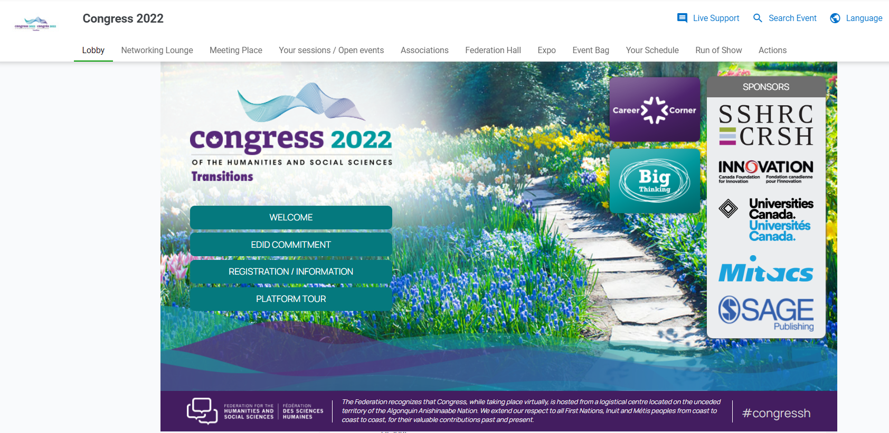
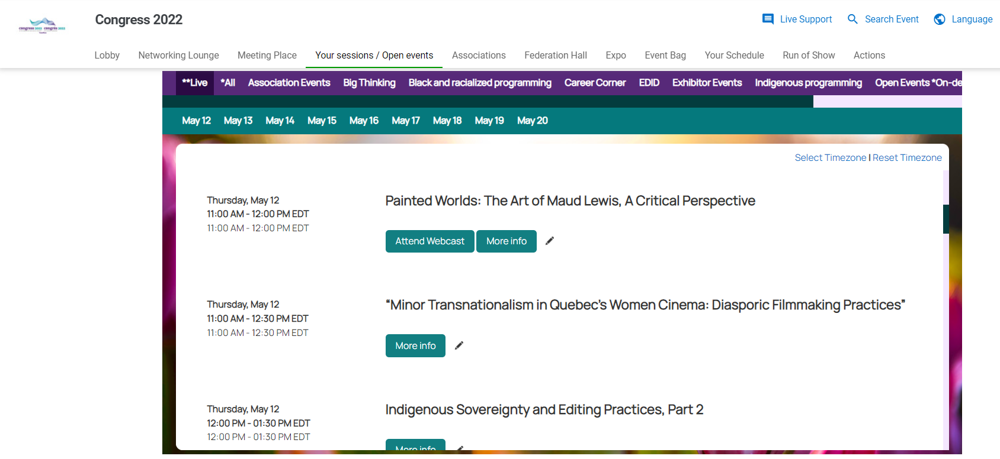
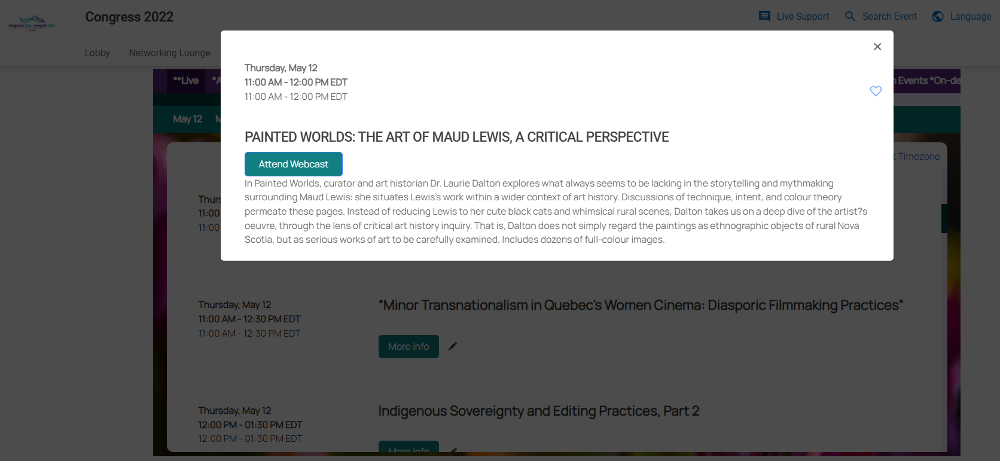
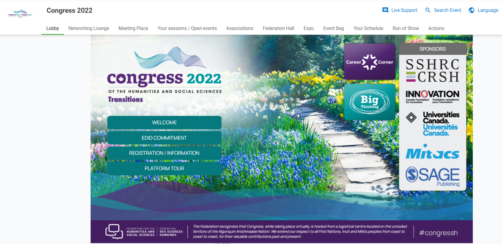
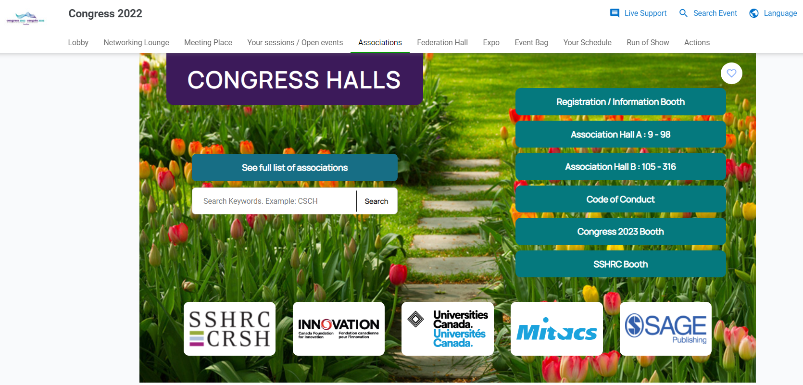
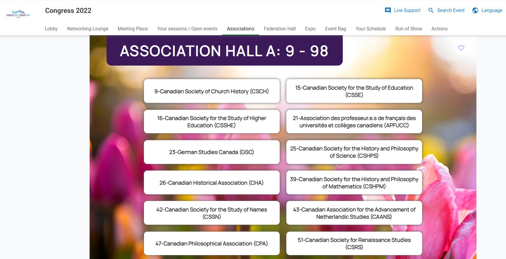
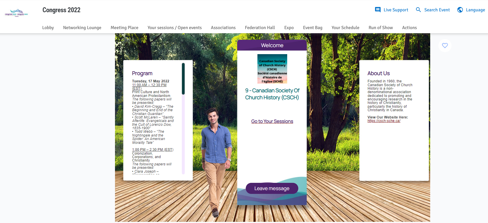

Panelists and speakers will need to sign in to the platform and navigate to their event.

 

There are two ways to do this.

1.  Go to **Your Sessions / Open events** tab

2.  Go to **Associations tab**

**OPTION 1:**

Go to **Your Sessions / Open events** tab

Find your date, and then select **More info**

A window will pop up and you’d select the **Attend Webcast** button to join the session

**OPTION 2:**

Go to **Associations tab**

Click on the Association Hall that you would like to enter. This is categorized by your association’s number.

When you are in the appropriate hall, click on your association.

Here you will be brought to the Greeting lounge. When you are in the Greeting lounge, click on “Go to your sessions”

Find your date, and then select **More info**

A window will pop up and you’d select the **Attend Webcast** button to join the session

Come event day presenters and moderators will be let into the green room of the session **15 minutes in advance** of the start time. We will have a designated event technician who will be the host of the session and we can ensure the appropriate folks are made cohosts for screen sharing or other purposes.  

 

The session will have a waiting room activated and attendees won’t be admitted until the session start time.

 

Forj support is available, and they are extremely helpful. It is important to note that no links will be sent to presenters, and that it is helpful and important that presenters look at the platform before the start of their session. Presenters will get access shortly.

Thanks!
